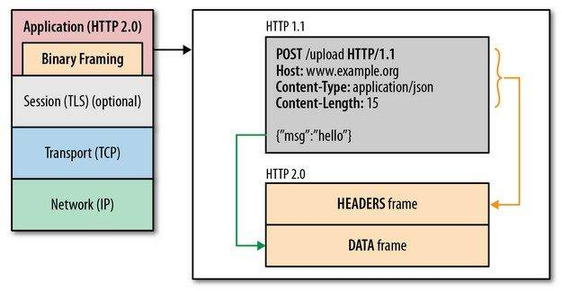
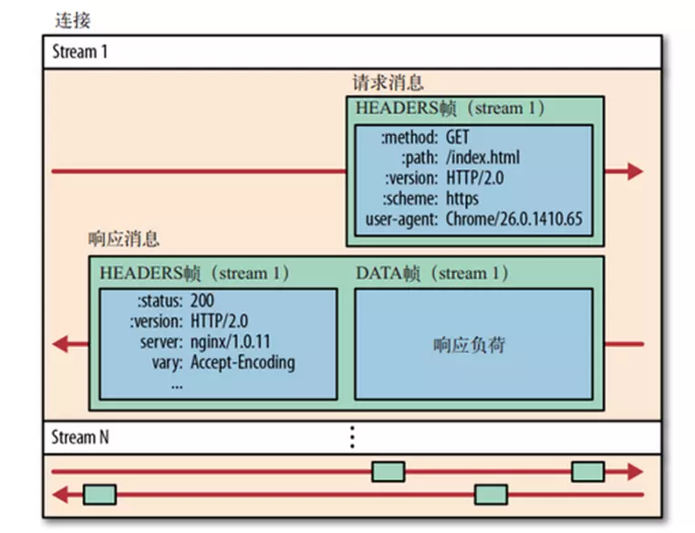
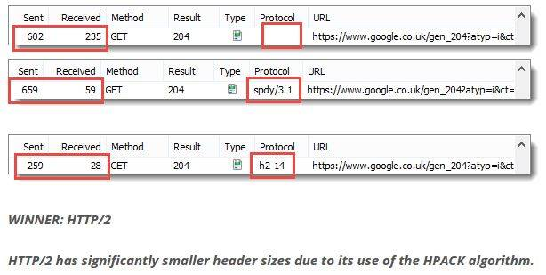
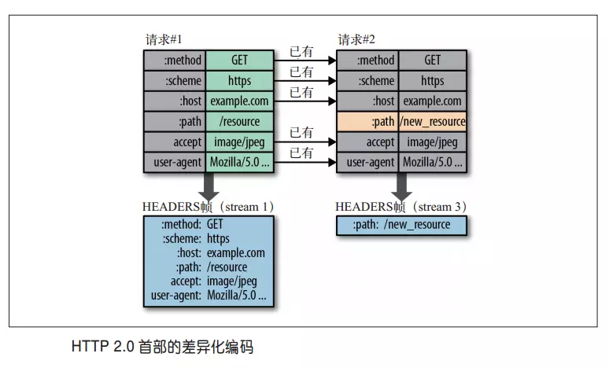
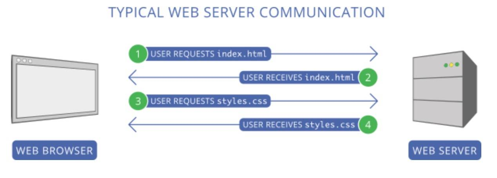
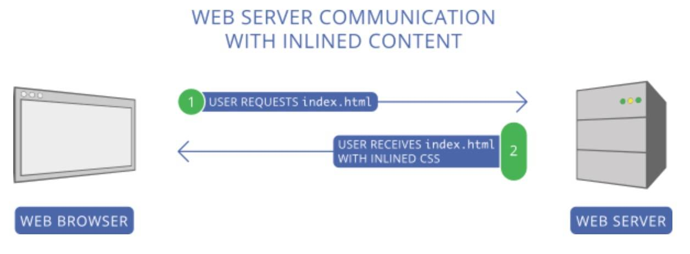
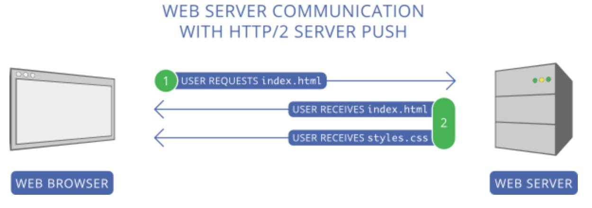
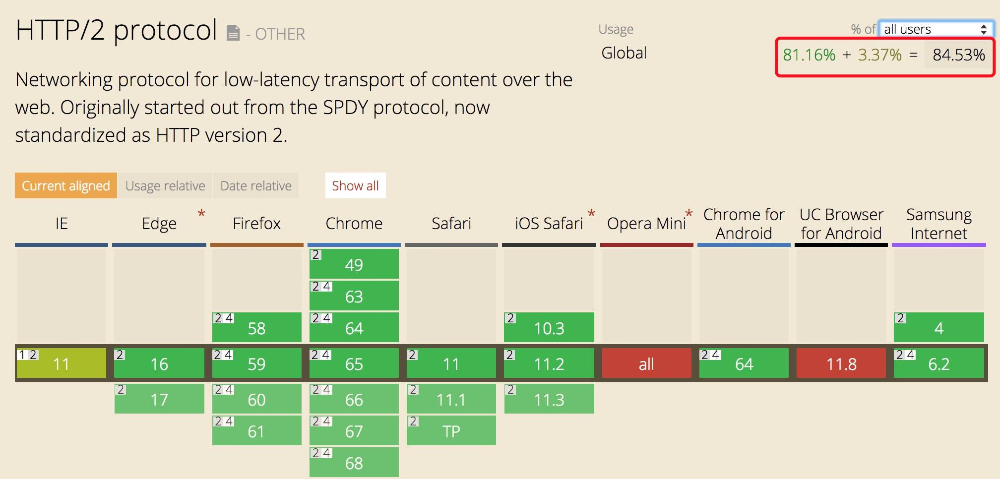

<br>

## 前言

本人平时学习及收集内容，欢迎参入一起讨论。

## 关于作者

一个工作八年的草根程序员。

## 内容

- [http发展史](#一、http发展史)
- [http1.x存在的问题](#二、http1.x存在的问题)
- [HTTP2新增加功能](#三、HTTP2新增加功能)
- [总结](#四、总结)
- [nginx配置HTTP2](#五、Nginx配置http2)

### 一、http发展史


### 二、http1.x存在的问题

- 协议规定客户端对同一域的迸发连接最多只能2个（浏览器实现一般2~8个），但是现代网页平均一个页面需要加载40个资源。
- 线头阻塞问题：同一个连接中的请求，需要一个接一个串行发送和接收
- 基于文本协议，请求和响应的头信息非常大，并且无法压缩。
- 不能控制响应优先级，必须按照请求顺序响应。
- 只能单向请求，也就是客户端请求什么，服务器只能返回什么。

### 三、HTTP2新增加功能

- 二进制分帧
- 首部压缩
- http2支持服务器推送
- 多路复用（Multiplexing）和流
- 优先级与依赖性

#### 3.1 二进制分帧

HTTP2在维持原有HTTP范式的前提下，实现突破性能限制，改进传输性能，实现低延迟和高吞吐量的其中一个关键是：**在应用层（HTTP2）和传输层（TCP or UDP）**之间增加了二进分帧层。


帧（Frame）是 HTTP2 通讯中的最小传输单位，所有帧以固定的 9 个八位字节头部开头，随后是一个可变长度的有效载荷

```
帧结构图
 +-----------------------------------------------+
 |                 长度Length (24)                |
 +---------------+---------------+---------------+
 |   类型Type (8)    |   标志Flags (8)   |
 +-+-------------+---------------+-------------------------------+
 |R|                 流标识符Stream Identifier (31)               |
 +=+=============================================================+
 |                   帧载荷Frame Payload (0...)                 ...
 +---------------------------------------------------------------+

```

规范中一共定义了10个不同的帧，其中最基础的两种分别对应于HTTP1.x 的 DATA 和 HEADERS。

一个真正的HTTP2请求类似下图：



#### 3.2 首部压缩

我们都知道**HTTP协议本身是无状态**的：每个请求之间**互不关联**，每个请求都需要携带服务器所需要的所有细节信息。比如说请求1发送服务器信息“我是用户A”，然后请求二发送信息“修改我的用户名为XX”，这时如果请求二没有携带“我是用户A”的信息，那么服务器是不知道要修改用户的用户名的。

这显然是不符合当前 web 应用系统架构的，因为一般系统都需要进行鉴权，日志记录，安全校验等限制，所以需要获取当前操作用户的信息，出于安全和性能考虑我们不能在消息体中明文包含这些信息，HTTP2 之前的解决方案一般是使用 Cookies 头、服务器session 等方式模拟出“状态”。而使用 Cookies 头的缺点就是每个请求都需要携带庞大的重复的信息并且无法压缩，假设一个请求的 header 是2kb，那么一百个请求就是重复的 200Kb 信息，这是一个巨大的带宽浪费。

HTTP2 增加了两个特性解决上述问题：

- [HPACK](https://link.juejin.im/?target=http%3A%2F%2Fhttp2.github.io%2Fhttp2-spec%2Fcompression.html)，专门为头部压缩设计的算法，还被指定成单独的草案中。



- 首部表，HTTP2 在户端和服务器端使用“首部表”来跟踪和存储之前发送的键-值对，对于相同的数据，不再通过每次请求和响应发送；通信期间几乎不会改变的通用键-值对（用户代理、可接受的媒体类型，等等）只需发送一次。



#### 3.3 http2支持服务器推送

这个功能通常被称作“缓存推送（cache push）”。主要的思想是：当一个客户端请求资源X，而服务器知道它很可能也需要资源Z的情况下，服务器可以在客户端发送请求Z前，主动将资源Z推送给客户端。这个功能帮助客户端将Z放进缓存以备将来之需。
服务器推送需要客户端显式的允许服务器提供该功能。但即使如此，客户端依然能自主选择是否需要中断该推送的流。如果不需要的话，客户端可以通过发送一个 RST_STREAM 帧来中止推送。
我们来看一下实际场景：现在我们访问一个网站，第一个请求一般是获取 Document 页面，然后浏览器解析这个页面，在遇到需要资源获取的时候（css、js、图片等），再去发起资源获取请求，如下图：



为了加速这个过程，减少白屏时间，传统的做法是把首页需要的资源都内联到 Document 中，还有合并资源比如 CSS sprites，js 压缩合并等。如下图：



在 HTTP2 的场景下，客户端在请求 Document 的时候，服务器如果知道页面需要的资源有哪些，就可以把那些资源也一同返回了：



使用 HTTP2 的多路复用和服务器推送功能，并不意味着可以减少甚至抛弃使用 CDN，因为 CDN 带来的现实地理位置上延迟减少是 HTTP2 所不能解决的，反而我们应该思考的是如何把 HTTP2 和 CDN 结合起来，进一步提升网络服务的效率和稳定性，减少延迟。

#### 3.4 多路复用（Multiplexing）和流

> 上一节提到的 Stream Identifier 将 HTTP2 连接上传输的每个帧都关联到一个“流”。流是一个独立的，双向的帧序列，可以通过一个 HTTP2 的连接在服务端与客户端之间不断的交换数据。
每个单独的 HTTP2 连接都可以包含多个并发的流，这些流中交错的包含着来自两端的帧。流既可以被客户端/服务器端单方面的建立和使用，也可以被双方共享，或者被任意一边关闭。在流里面，每一帧发送的顺序非常关键。接收方会按照收到帧的顺序来进行处理。

“流”是一个逻辑上的概念（没有真正传输流这么个东西），是 HTTP2 连接中在客户端和服务器之间交换的独立双向帧序列，这就是为什么在规范中的 stream 也是用双引号括起来的原因。从上一节我们可以知道，HTTP2 的传输单位是帧，流其实就是一个帧的分组集合的概念，为什么需要这个逻辑集合呢？答案就在多路复用。

多路复用是解决 HTTP1.x 缺陷第一点（并发问题）和第二点（HOLB线头问题）的核心技术点。

#### 3.5 优先级与依赖性

每个流都包含一个优先级（也就是“权重”），它被用来告诉对端哪个流更重要。当资源有限的时候，服务器会根据优先级来选择应该先发送哪些流。

借助于PRIORITY帧，客户端同样可以告知服务器当前的流依赖于其他哪个流。该功能让客户端能建立一个优先级“树”，所有“子流”会依赖于“父流”的传输完成情况。
优先级和依赖关系可以在传输过程中被动态的改变。这样当用户滚动一个全是图片的页面的时候，浏览器就能够指定哪个图片拥有更高的优先级。或者是在你切换标签页的时候，浏览器可以提升新切换到页面所包含流的优先级。

#### 3.6 浏览器与服务器已经对http2协议提供了支持



### 四、总结

HTTP2能带来的好处：

1. 更小的传输体积，更小或者省略重复的头消息
2. 突破原有的 TCP 连接并发限制，使用一个 TCP 连接即可实现多请求并发，单链接也能减轻服务端的压力（更少的内存和 CPU 使用）
3. 解决 HOLB 线头问题，慢的请求或者先发送的请求不会阻塞其他请求的返回
4. 结合 CDN 提供实时性更高，延迟更低的内容分发代理服务，大大减少白屏时间
5. 数据传输优先级可控，使网站可以实现更灵活和强大的页面控制
6. 能在不中断 TCP 连接的情况下停止（重置）数据的发送

### 五、Nginx配置http2

#### 5.1 安装openssl-1.1.0c

```
cd /root

wget https://www.openssl.org/source/openssl-1.1.0c.tar.gz

tar -zxf openssl-1.1.0c.tar.gz

cd openssl-1.1.0c

./config

make

make install


#把旧版本的openssl重命名
mv /usr/bin/openssl /usr/bin/openssl.bak
mv /usr/include/openssl /usr/include/openssl.bak

#设置软连接指向刚编译好的新版本的openssl-1.1.0c
ln -s /usr/local/bin/openssl /usr/bin/openssl
ln -s /usr/local/include/openssl /usr/include/openssl
#如果是1.0.2h版本 生成的文件的位置在/usr/local/ssl

#添加libssl.so.1.1的软链接
ln -s /usr/local/lib64/libssl.so.1.1 /usr/lib64/libssl.so.1.1
ln -s /usr/local/lib64/libcrypto.so.1.1 /usr/lib64/libcrypto.so.1.1

#查看openssl版本
openssl version
```

#### 5.2 平滑升级nginx到最新的稳定版

```
#下载nginx最新版
cd /root
wget http://nginx.org/download/nginx-1.10.2.tar.gz
#解压源码
tar zxvf nginx-1.10.2.tar.gz
#进入源码目录
cd nginx-1.10.2

#加上所需参数开始编译
./configure --user=www --group=www --prefix=/usr/local/nginx --with-http_stub_status_module --with-http_ssl_module --with-http_v2_module --with-http_gzip_static_module --with-ipv6 --with-http_sub_module --with-openssl=/root/openssl-1.1.0c #对应openssl源码解压后的路径

#执行make编译，但是不要执行make install

make

#重命名nginx旧版本二进制文件，即sbin目录下的nginx（期间nginx并不会停止服务）
mv /usr/local/nginx/sbin/nginx /usr/local/nginx/sbin/nginx.old

#然后拷贝一份新编译的二进制文件
cp objs/nginx /usr/local/nginx/sbin/
#在源码目录执行make upgrade开始升级
make upgrade

#完成后查看下版本
nginx -V
```

#### 5.3 配置http2.0

配置Nginx开启http 2.0特别简单，只要在Nginx配置文件中找到你要开启http2.0的域名server模块，然后将 listen 443 ssl;改成 listen 443 ssl http2; 即可。

```
server {

	listen 443 ssl http2;
	server_name domain.com;

	ssl_certificate /path/to/public.crt;
	ssl_certificate_key /path/to/private.key;
	
	ssl_protocols TLSv1 TLSv1.1 TLSv1.2; #允许的协议 
	ssl_ciphers EECDH+CHACHA20:EECDH+AES128:RSA+AES128:EECDH+AES256:RSA+AES256:EECDH+3DES:RSA+3DES:!MD5; #加密算法(CloudFlare 推荐的加密套件组) 
	ssl_prefer_server_ciphers on; #优化 SSL 加密套件 
	ssl_session_timeout 10m; #客户端会话缓存时间 
	ssl_session_cache builtin:1000 shared:SSL:10m; #SSL 会话缓存类型和大小 
	ssl_buffer_size 1400; # 1400 bytes to fit in one MTU
}
```

### 参考资料

- [HTTP2基本概念学习笔记](https://juejin.im/post/5acccf966fb9a028d043c6ec)
- [HTTP 2.0 的那些事](https://juejin.im/entry/57fa127d816dfa0056b7d710)
- [openssl 版本升级操作记录](https://cloud.tencent.com/developer/article/1027523)
- [怎样把网站升级到 http/2](https://zhuanlan.zhihu.com/p/29609078)
- [升级 Nginx 开启 HTTP/2](https://juejin.im/entry/5b5ae460e51d45195423ecca)

## 联系作者

<div align="center">
    <p>
        平凡世界，贵在坚持。
    </p>
    
</div>