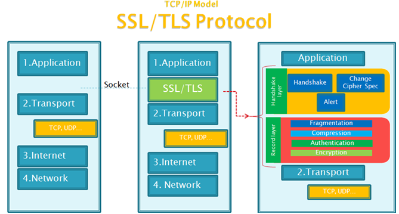
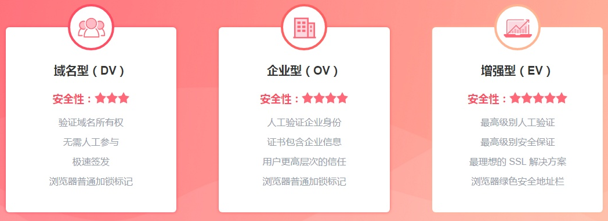
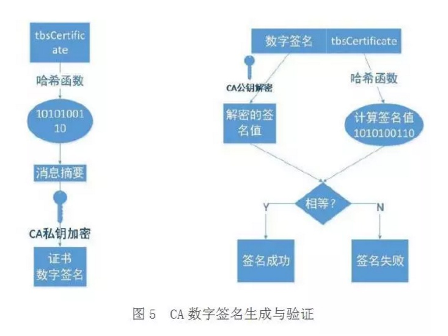

<br>

## 前言

本人平时学习及收集内容，欢迎参入一起讨论。

## 关于作者

一个工作八年的草根程序员。

## 内容

- 什么是HTTPS
- 为什么需要https
- HTTPS如何加密数据的
- HTTPS过程
- 证书
- HTTPS性能损耗

### 一、什么是HTTPS

 HTTPS并非是应用层的一种新协议。只是HTTP通信接口部分用SSL(Secure Socket Layer)和TLS协议代替而已。

 简单理解就是https=http+加密+认证+完整性保护

 如下图所示：

 

#### SSL与TLS介绍

 - SSL（Secure Socket Layer，安全套接字层）：1994年为 Netscape 所研发，SSL 协议位于 TCP/IP 协议与各种应用层协议之间，为数据通讯提供安全支持。

- TLS（Transport Layer Security，传输层安全）：其前身是 SSL，它最初的几个版本（SSL 1.0、SSL 2.0、SSL 3.0）由网景公司开发，1999年从 3.1 开始被 IETF 标准化并改名，发展至今已经有 TLS 1.0、TLS 1.1、TLS 1.2 三个版本。SSL3.0和TLS1.0由于存在安全漏洞，已经很少被使用到。TLS 1.3 改动会比较大，目前还在草案阶段，目前使用最广泛的是TLS 1.1、TLS 1.2。

### 二、为什么需要https

HTTP是明文传输的，也就意味着，介于发送端、接收端中间的任意节点都可以知道你们传输的内容是什么。这些节点可能是路由器、代理等。

HTTP传输面临的风险有：

- 窃听风险：黑客可以获知通信内容。
- 篡改风险：黑客可以修改通信内容。
- 冒充风险：黑客可以冒充他人身份参与通信。

### 三、加密方式

- 对称加密
- 非对称加密

#### 3.1 对称加密

对称加密的意思就是，加密数据用的密钥，跟解密数据用的密钥是一样的。

对称加密的优点在于加密、解密效率通常比较高。缺点在于，数据发送方、数据接收方需要协商、共享同一把密钥，并确保密钥不泄露给其他人。此外，对于多个有数据交换需求的个体，两两之间需要分配并维护一把密钥，这个带来的成本基本是不可接受的。

#### 3.2 非对称加密

非对称加密的意思就是，加密数据用的密钥（公钥），跟解密数据用的密钥（私钥）是不一样的。其实就是字面上的意思——公开的密钥，谁都可以查到。因此非对称加密也叫做公开密钥加密。相对应的，私钥就是非公开的密钥，一般是由网站的管理员持有。简单的说就是，通过公钥加密的数据，只能通过私钥解开。通过私钥加密的数据，只能通过公钥解开。

### 四、HTTPS过程


1. 客户端发送HTTPS请求给服务器端；
2. 服务器端发送CA证书和公钥PublicKey给客户端,注意这个公钥用的是非对称密钥,只有服务器端才有PublicKey对应的PrivateKey；
3. 客户端生成一个会话的密钥SessionKey,注意这个SessionKey是对称密钥,加密解密都是同一个秘钥；
4. 客户端用公钥PublicKey来对会话秘钥SessionKey进行加密生成EncryptKey传递给服务器；
5. 服务器端收到这个加密后的EncryptKey后用PrivateKey解密就可以得到这个SessionKey了；
6. 服务器端收到这个加密后的EncryptKey需要回复一个确认消息给客户端；
7. 客户端用这个SessionKey来对后续需要发送的Message来进行加密，就是EncryptMessage，然后发送给服务器端；
8. 服务器端收到这个EncryptMessage后就需要拿刚才解密的SessionKey来进行解密；就可以得到Message了；
9. 服务器端根据客户端的请求来进行返回一系列的Response响应；

### 五、证书

- 数字签名
- CA
- 证书的种类
- ssl证书的格式
- ssl证书内容
- 如何辨别非法证书

#### 5.1 数字签名

简单的来说，“摘要”就是对传输的内容，通过hash算法计算出一段固定长度的串。然后，在通过CA的私钥对这段摘要进行加密，加密后得到的结果就是“数字签名”。

```
明文 --> hash运算 --> 摘要 --> 私钥加密 --> 数字签名
```

#### 5.2 CA

CA(Certificate Authority)，即证书认证机构，它的作用就是提供证书（即服务器证书，由域名、公司信息、序列号和签名信息组成）加强服务端和客户端之间信息交互的安全性，以及证书运维相关服务。任何个体/组织都可以扮演 CA 的角色，难的是你要能得到全世界各大操作系统、浏览器等的默认信任，能得到他们的默认信任，你也可以自己开一家CA公司了，这类证书通常叫做根证书。浏览器默认信任的 CA 大厂商有很多，比如 Symantec赛门铁克、Comodo、Godaddy、GolbalSign(百度微博等都是它签发的) 和 Digicert。

1. 证书的颁发：接收、验证用户(包括下级认证中心和最终用户)的数字证书的申请。可以受理或拒绝
2. 证书的更新：认证中心可以定期更新所有用户的证书，或者根据用户的请求来更新用户的证书
3. 证书的查询：查询当前用户证书申请处理过程；查询用户证书的颁发信息，这类查询由目录服务器ldap来完成
4. 证书的作废：由于用户私钥泄密等原因，需要向认证中心提出证书作废的请求；证书已经过了有效期，认证中心自动将该证书作废。认证中心通过维护证书作废列表 (Certificate Revocation List,CRL) 来完成上述功能。
5. 证书的归档：证书具有一定的有效期，证书过了有效期之后就将作废，但是我们不能将作废的证书简单地丢弃，因为有时我们可能需要验证以前的某个交易过程中产生的数字签名，这时我们就需要查询作废的证书。

#### 5.3 证书的种类

SSL 证书按大类一般可分为`DV SSL`、`OV SSL`、`EV SSL`证书，又叫域名型、企业型、增强型证书：



- DV SSL(Domain Validation)，域名型SSL证书，证书颁布机构只对域名的所有者进行在线检查，只要你能证明你是这个域名的所有者就可以给你颁发证书，不会校验网站的资质，哪怕你是黄赌毒网站也可以，个人网站、非盈利项目、开源项目等域名型证书足矣；
- OV SSL(`Organization Validation`)，企业型SSL证书，需要购买者提交组织机构资料和单位制空权信等在官方注册的凭证，证书颁发机构在签发SSL证书前不仅仅要检验域名所有权，还必须对这些资料的真实合法性进行多方查验，只能通过验证的才能颁发SSL证书；
- EV SSL(Extended Validations)，增强型SSL证书(EV SSL)，验证流程加具体详细，验证步骤更多，这样一来证书所绑定的网站就更加的可靠、可信。它跟普通`SSL`证书的区别是浏览器的地址栏变绿，如果是不受信的SSL证书则拒绝显示，如果是钓鱼网站，地址栏则会变成红色，以警示用户。

#### 5.4 ssl证书的格式

```
1. 证书版本号(Version)
版本号指明X.509证书的格式版本，现在的值可以为:
    1) 0: v1
    2) 1: v2
    3) 2: v3
也为将来的版本进行了预定义

2. 证书序列号(Serial Number)
序列号指定由CA分配给证书的唯一的"数字型标识符"。当证书被取消时，实际上是将此证书的序列号放入由CA签发的CRL中，
这也是序列号唯一的原因。

3. 签名算法标识符(Signature Algorithm)
签名算法标识用来指定由CA签发证书时所使用的"签名算法"。算法标识符用来指定CA签发证书时所使用的:
    1) 公开密钥算法
    2) hash算法
example: sha256WithRSAEncryption
须向国际知名标准组织(如ISO)注册

4. 签发机构名(Issuer)
此域用来标识签发证书的CA的X.500 DN(DN-Distinguished Name)名字。包括:
    1) 国家(C)
    2) 省市(ST)
    3) 地区(L)
    4) 组织机构(O)
    5) 单位部门(OU)
    6) 通用名(CN)
    7) 邮箱地址

5. 有效期(Validity)
指定证书的有效期，包括:
    1) 证书开始生效的日期时间
    2) 证书失效的日期和时间
每次使用证书时，需要检查证书是否在有效期内。

6. 证书用户名(Subject)
指定证书持有者的X.500唯一名字。包括:
    1) 国家(C)
    2) 省市(ST)
    3) 地区(L)
    4) 组织机构(O)
    5) 单位部门(OU)
    6) 通用名(CN)
    7) 邮箱地址

7. 证书持有者公开密钥信息(Subject Public Key Info)
证书持有者公开密钥信息域包含两个重要信息:
    1) 证书持有者的公开密钥的值
    2) 公开密钥使用的算法标识符。此标识符包含公开密钥算法和hash算法。
8. 扩展项(extension)
X.509 V3证书是在v2的基础上一标准形式或普通形式增加了扩展项，以使证书能够附带额外信息。标准扩展是指
由X.509 V3版本定义的对V2版本增加的具有广泛应用前景的扩展项，任何人都可以向一些权威机构，如ISO，来
注册一些其他扩展，如果这些扩展项应用广泛，也许以后会成为标准扩展项。

9. 签发者唯一标识符(Issuer Unique Identifier)
签发者唯一标识符在第2版加入证书定义中。此域用在当同一个X.500名字用于多个认证机构时，用一比特字符串
来唯一标识签发者的X.500名字。可选。

10. 证书持有者唯一标识符(Subject Unique Identifier)
持有证书者唯一标识符在第2版的标准中加入X.509证书定义。此域用在当同一个X.500名字用于多个证书持有者时，
用一比特字符串来唯一标识证书持有者的X.500名字。可选。

11. 签名算法(Signature Algorithm)
证书签发机构对证书上述内容的签名算法
example: sha256WithRSAEncryption

12. 签名值(Issuer's Signature)
证书签发机构对证书上述内容的签名值

```

#### 5.5 ssl证书内容

1. 颁发证书的机构的名字--CA
2. 证书内容本身的数字签名（用CA私钥加密）
3. 证书持有者的公钥
4. 证书签名用到的hash算法

#### 5.6 如何辨别非法证书

**完全伪造的证书**

1. 证书颁发的机构是伪造的：浏览器不认识，直接认为是危险证书
2. 证书颁发的机构是确实存在的，于是根据CA名，找到对应内置的CA根证书、CA的公钥。
3. 用CA的公钥，对伪造的证书的摘要进行解密，发现解不了。认为是危险证书

**篡改过的证书**

1. 检查证书，根据CA名，找到对应的CA根证书，以及CA的公钥。
2. 用CA的公钥，对证书的数字签名进行解密，得到对应的证书摘要AA
3. 根据证书签名使用的hash算法，计算出当前证书的摘要BB
4. 对比AA跟BB，发现不一致--> 判定是危险证书

验证过程如图：



#### 5.7 自发签名证书

这里不具体讲了，可以参考：[HTTPS从认识到线上实战全记录](https://www.cnblogs.com/liuxianan/p/https.html#%E8%87%AA%E5%88%B6%E8%AF%81%E4%B9%A6)、[HTTPS自建CA及自签名证书不完全指南（实战篇）](https://futu.im/posts/2017-08-03-https-certificate/)

### 六、HTTPS性能损耗

HTTPS 原理与优势：身份验证、信息加密与完整性校验等，且未对 TCP 和 HTTP 协议做任何修改。但通过增加新协议以实现更安全的通信必然需要付出代价，HTTPS 协议的性能损耗主要体现如下：

- 增加延时
- 消耗较多的`CPU`资源

#### 6.1 增加延时

分析前面的握手过程，一次完整的握手至少需要两端依次来回两次通信，至少增加延时2 RTT，利用会话缓存从而复用连接，延时也至少1 RTT*。

#### 6.2 消耗较多的`CPU`资源

除数据传输之外，HTTPS 通信主要包括对对称加解密、非对称加解密(服务器主要采用私钥解密数据)；压测 TS8 机型的单核 CPU：对称加密算法AES-CBC-256 吞吐量 600Mbps，非对称 RSA 私钥解密200次/s。不考虑其它软件层面的开销，10G 网卡为对称加密需要消耗 CPU 约17核，24核CPU最多接入 HTTPS 连接 4800；

静态节点当前10G 网卡的 TS8 机型的 HTTP 单机接入能力约为10w/s，如果将所有的 HTTP 连接变为HTTPS连接，则明显 RSA 的解密最先成为瓶颈。因此，RSA 的解密能力是当前困扰 HTTPS 接入的主要难题。

### 参考资料

- [HTTPS过程](http://www.cnblogs.com/Jote/articles/4854958.html)
- [全站`HTTPS`来了](https://segmentfault.com/a/1190000004199917)
- [数字签名和数字证书](http://www.cnblogs.com/heart-runner/archive/2012/01/30/2332020.html)
- [HTTPS科普扫盲帖](http://www.cnblogs.com/chyingp/p/https-introduction.html)
- [https原理通俗了解](http://www.cnblogs.com/zhangshitong/p/6478721.html)
- [看完这篇文章，我奶奶都懂了 https 的原理](https://www.cnblogs.com/sujing/p/10927569.html)
- 


## 联系作者

<div align="center">
    <p>
        平凡世界，贵在坚持。
    </p>
    
</div>