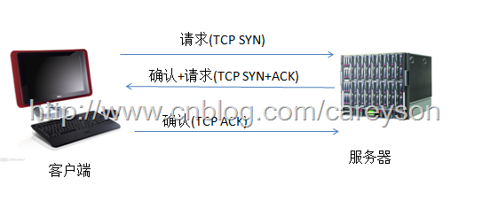
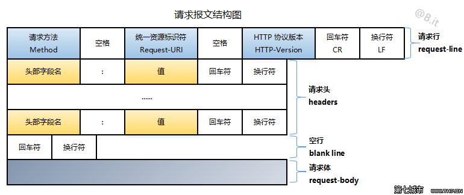
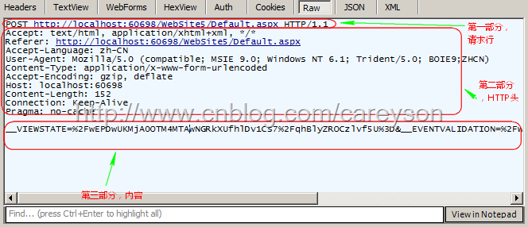

<br>

## 前言

本人平时学习及收集内容，欢迎参入一起讨论。

## 关于作者

一个工作八年的草根程序员。

## 内容

- [http 的定义和历史](#一、http的定义和历史)
- [http 三次握手](#二、http三次握手)
- [http 的主要特点](#三、http的主要特点)
- [http 请求详解](#四、http请求详解)
- [http 响应详解](#五、http响应详解)

### 一、http 的定义和历史

HTTP 是一个属于应用层的面向对象的协议，由于其简捷、快速的方式，适用于分布式超媒体信息系统。它于 1990 年提出，经过几年的使用与发展，得到不断地完善和扩展。目前已经经历了四个版本，分别是 http0.9，http1.0,http1.1 及去年刚发布的 http2.0。

### 二、http 三次握手

HTTP 是基于传输层的 TCP 协议，而 TCP 是一个端到端的面向连接的协议。所谓的端到端可以理解为进程到进程之间的通信.



### 三、http 的主要特点

1. 支持客户/服务器模式
2. **简单快速：** 客户向服务器请求服务时，只需传送请求方法和路径。请求方法常用的有 GET、HEAD、POST。每种方法规定了客户与服务器联系的类型不同。由于 HTTP 协议简单，使得 HTTP 服务器的程序规模小，因而通信速度很快。
3. **灵活：** http 允许传轮任意类型的数据对象。正在传输的类型由 Content-Type 加以标记。
4. **无连接：** HTTP 协议是无状态协议。无状态是指协议对于事务处理没有记忆能力。缺少状态意味着如果后续处理需要前面的信息，则它必须重传，这样可能导致每次连接传送的数据量增大。另一方面，在服务器不需要先前信息时它的应答就较快。

### 四、http 请求详解

http 请求由三部分组成，分别是：请求行、消息报头、请求正文


**http 的请求方法：** `GET`、`POST`、`HEAD`、`PUT`、`DELETE`、`TRACE`、`CONNECT`、`OPTIONS`

- `GET`：请求获取 Request-URI 所标识的资源
- `POST`：在 Request-URI 所标识的资源后附加新的数据
- `HEAD`：请求获取由 Request-URI 所标识的资源的响应消息报头
- `PUT`：请求服务器存储一个资源，并用 Request-URI 作为其标识
- `DELETE`：请求服务器删除 Request-URI 所标识的资源
- `TRACE`：请求服务器回送收到的请求信息，主要用于测试或诊断
- `CONNECT`：保留将来使用
- `OPTIONS`：请求查询服务器的性能，或者查询与资源相关的选项和需求

**HTTP 请求由三部分组成：** 请求行、http 头、内容

- 请求行内容如下：`GET www.cnblogs.com HTTP/1.1`请求行写法是固定的，由三部分组成，第一部分是请求方法，第二部分是请求网址，第三部分是 HTTP 版本。
- 第二部分 HTTP 头在 HTTP 请求可以是 3 种 HTTP 头：1.请求头(request header) 2.普通头(general header) 3.实体头(entity header) 通常来说，由于 Get 请求往往不包含内容实体，因此也不会有实体头。
- 第三部分内容只在 POST 请求中存在，因为 GET 请求并不包含任何实体。

完整的 http 请求图如下：



#### 请求报文示例

```
GET / HTTP/1.1
Host: www.baidu.com
Connection: keep-alive
Cache-Control: max-age=0
Upgrade-Insecure-Requests: 1
User-Agent: Mozilla/5.0 (Macintosh; Intel Mac OS X 10_12_3) AppleWebKit/537.36 (KHTML, like Gecko) Chrome/57.0.2987.110 Safari/537.36
Accept: text/html,application/xhtml+xml,application/xml;q=0.9,image/webp,*/*;q=0.8
Accept-Encoding: gzip, deflate, sdch, br
Accept-Language: zh-CN,zh;q=0.8,en;q=0.6,id;q=0.4
Cookie: PSTM=1490844191; BIDUPSID=2145FF54639208435F60E1E165379255; BAIDUID=CFA344942EE2E0EE081D8B13B5C847F9:FG=1;
```

#### 请求行

请求行由请求方法、URL 和 HTTP 协议版本组成，它们之间用空格分开。

`GET / HTTP/1.1`

#### 请求头

请求头由 key-value 对组成，每行一对，key (键) 和 value (值)用英文冒号 : 分隔。请求头通知服务器有关于客户端请求的信息，典型的请求头有：

- `User-Agent`：用户代理信息 - `Mozilla/5.0 (Macintosh; Intel Mac OS X 10_12_3) AppleWebKit/537.36` ...
- `Accept`：客户端可识别的内容类型列表 - text/html,application/xhtml+xml,application/xml
- `Accept-Language`：客户端可接受的自然语言 - zh-CN,zh;q=0.8,en;q=0.6,id;q=0.4
- `Accept-Encoding`：客户端可接受的编码压缩格式 - gzip, deflate, sdch, br
- `Host`：请求的主机名，允许多个域名同处一个 IP 地址，即虚拟主机 - www.baidu.com
- `connection`：连接方式
- `close`：告诉 WEB 服务器或代理服务器，在完成本次请求的响应后，断开连接
- `keep-alive`：告诉 WEB 服务器或代理服务器。在完成本次请求的响应后，保持连接，以等待后续请求
- `Cookie`：存储于客户端扩展字段，向同一域名的服务端发送属于该域的 cookie - PSTM=1490844191; BIDUPSID=2145FF54639208435F60E1E165379255;

#### 空行

最后一个请求头之后是一个空行，发送回车符和换行符，通知服务器以下不再有请求头。

#### 请求体

请求数据不在 GET 方法中使用，而是在 POST 方法中使用。与请求数据相关的最常使用的请求头是 Content-Type 和 Content-Length。

### 五、http 响应详解

当 Web 服务器收到 HTTP 请求后，会根据请求的信息做某些处理(这些处理可能仅仅是静态的返回页，或是包含 Asp.net,PHP,Jsp 等语言进行处理后返回)，相应的返回一个 HTTP 响应。HTTP 响应在结构上很类似于 HTTP 请求,也是由三部分组成，分别为:状态行 HTTP 头 返回内容


响应报文示例

```
HTTP/1.1 200 OK
Server: bfe/1.0.8.18
Date: Thu, 30 Mar 2017 12:28:00 GMT
Content-Type: text/html; charset=utf-8
Connection: keep-alive
Cache-Control: private
Expires: Thu, 30 Mar 2017 12:27:43 GMT
Set-Cookie: BDSVRTM=0; path=/
```

#### 状态行

状态行格式： `HTTP-Version`、`Status-Code`、`Reason-Phrase`、`CRLF`

1. `HTTP-Version` - HTTP 协议版本
2. `Status-Code` - 状态码
3. `Reason-Phrase` - 状态码描述
4. `CRLF` - 回车/换行符

#### 响应头

响应头由 key-value 对组成，每行一对，key (键) 和 value (值)用英文冒号 : 分隔。响应头域允许服务器传递不能放在状态行的附加信息，这些域主要描述服务器的信息和 Request-URI 进一步的信息，典型的响应头有：

- `Server`：包含处理请求的原始服务器的软件信息
- `Date`：服务器日期
- `Content-Type`：返回的资源类型 (MIME)
- `Connection`：连接方式
- `close`：连接已经关闭
- `keep-alive`：连接已保持，在等待本次连接的后续请求
- `Cache-Control`：缓存控制
- `Expires`：设置过期时间
- `Set-Cookie`：设置 Cookie 信息

#### 空行

最后一个响应头之后是一个空行，发送回车符和换行符，通知浏览器以下不再有响应头。

#### 响应体

服务器返回给浏览器的响应信息，下面是百度首页的响应体片段：

```
<!DOCTYPE html>
<!--STATUS OK-->
<html>
<head>
    <meta http-equiv="content-type" content="text/html;charset=utf-8">
    <meta http-equiv="X-UA-Compatible" content="IE=Edge">
    <link rel="icon" sizes="any" mask href="//www.baidu.com/img/baidu.svg">
    <title>百度一下，你就知道</title>
</head>
<body>
  ...
</body>
</html>
```

#### 状态码

状态代码由三位数字组成，第一个数字定义了响应的类别，且有五种可能取值：

- `1xx`：指示信息 – 表示请求已接收，继续处理
- `2xx`：成功 – 表示请求已被成功接收
- `3xx`：重定向 – 要完成请求必须进行更进一步的操作
- `4xx`：客户端错误 – 请求有语法错误或请求无法实现
- `5xx`：服务器错误 – 服务器未能实现合法的请求

常见状态代码、状态描述的说明如下：

- `200 OK`：客户端请求成功
- `204 No Content`：没有新文档，浏览器应该继续显示原来的文档
- `206 Partial Content`：客户发送了一个带有 Range 头的 GET 请求，服务器完成了它
- `301 Moved Permanently`：所请求的页面已经转移至新的 url
- `302 Found`：所请求的页面已经临时转移至新的 url
- `304 Not Modified`：客户端有缓冲的文档并发出了一个条件性的请求，服务器告诉客户，原来缓冲的文档还可以继续使用。
- `400 Bad Request`：客户端请求有语法错误，不能被服务器所理解
- `401 Unauthorized`：请求未经授权，这个状态代码必须和 WWW-Authenticate 报头域一起使用
- `403 Forbidden`：对被请求页面的访问被禁止
- `404 Not Found`：请求资源不存在
- `500 Internal Server Error`：服务器发生不可预期的错误
- `503 Server Unavailable`：请求未完成，服务器临时过载或当机，一段时间后可能恢复正常

## 参考资料

- [HTTP 协议漫淡](http://www.cnblogs.com/CareySon/archive/2012/04/27/HTTP-Protocol.html)
- [http 协议详解](http://www.cnblogs.com/li0803/archive/2008/11/03/1324746.html)
- [http 协议](https://github.com/semlinker/awesome-http#http-%E5%8D%8F%E8%AE%AE)
- 《图解 http》

## 联系作者

<div align="center">
    <p>
        平凡世界，贵在坚持。
    </p>
    
</div>
