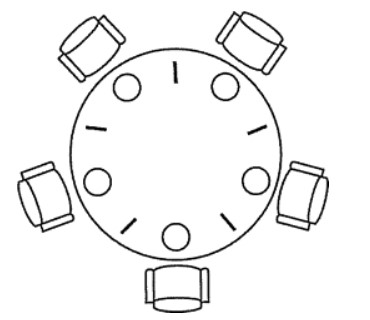

<br>

## 前言

在本文将深入展开在面试过程中操作系统部分的知识，用最简短的篇章深入理解。

## 关于作者

一个工作八年的草根程序员。

## 内容

- 概述
- 进程管理
- 死锁
- 内存管理
- 设备管理
- 链接

### 一、概述

- 操作系统基本特征
- 操作系统基本功能
- 系统调用
- 大内核和微内核
- 中断分类
- 什么是堆和栈？说一下堆栈都存储哪些数据？
- 如何理解分布式锁？

#### 1.1 操作系统基本特征

- 并发与并行
- 共享
- 虚拟
- 异步

##### 并发与并行

**并发**是指宏观上在一段时间内能同时运行多个程序，而**并行**则指同一时刻能运行多个指令。

**并行**需要硬件支持，如多流水线或者多处理器。

操作系统通过引入进程和线程，使得程序能够并发运行。


##### 共享

共享是指系统中的资源可以被多个并发里程共同使用。

有两种共享方式：互斥共享和同时共享。

**互斥共享**的资源称为临界资源，例如打印机等，在同一时间只允许一个进程访问，需要用同步机制来实现对临界资源的访问。

##### 虚拟

虚拟技术把一个物理实体转换为多个逻辑实体。

利用多道程序设计技术，让每个用户都觉得有一个计算机专门为他服务。

主要有两种虚拟技术：**时分复用技术和空分复用技术**。例如多个进程能在同一个处理器上并发执行使用了时分复用技术，让每个进程轮流占有处理器，每次只执行一小个时间片并快速切换。

##### 异步

异步指进程不是一次性执行完毕，而是走走停停，以不可知的速度向前推进。

但只要运行环境相同，OS需要保证程序运行的结果也要相同。

#### 1.2 操作系统基本功能

- 进程管理
- 内存管理
- 文件管理
- 设备管理

##### 进程管理

进程控制、进程同步、进程通信、死锁处理、处理机调试等。

##### 内存管理

内在分配、地址映射、内在保护与共享、虚拟内存等。

##### 文件管理

文件存储空间的管理、目录管理、文件读写管理和保护等。

##### 设备管理

完成用户的I/O请求，方便用户使用各种设备，并提高设备的利用率。

主要包括缓冲管理、设备分配、设备处理、虚拟设备等。

#### 1.3 系统调用

如果一个进程在**用户态**需要使用**内核态**的功能，就进行系统调用从而陷入内核，由操作系统代为完成。


Linux 的系统调用主要有以下这些：

| Task     | Commands                  |
| -------- | ------------------------- |
| 进程控制 | fork();exit();wait();     |
| 进程通信 | pipe();chmget();mmap();   |
| 文件操作 | open();read();write();    |
| 设备操作 | ioctl();read();write();   |
| 信息维护 | getpid();alarm();sleep(); |
| 安全     | chmod();umask();chown();  |


#### 1.4 大内核和微内核

- 大内核
- 微内核

##### 大内核

大内核是将操作系统功能作为一个紧密结合的整体放到内核。

由于各模块共享信息，因此有很高的性能。

##### 微内核

由于操作系统不复杂，因此将一部分操作系统功能移出内核，从而降低内核的复杂性。移出的部分根据分层的原则划分成若干服务，相互独立。

在微内核结构下，操作系统被划分成小的、定义良好的模块，只有微内核这一个运行在内核态，其余模块运行在用户态。

因为需要频繁地在用户态和核心态之间进行切换，所以会有一定的性能损失。


#### 1.5 中断分类

- 外中断
- 异常
- 陷入

##### 外中断

由CPU执行指令以外的事件引起，如I/O完成中断，表示设备输入/输出处理已经完成，处理器能够发送下一个输入/输出请求。此外还有时钟中断、控制台中断等。

##### 异常

由CPU执行指令的内部事件引起，如非法操作码、地址越界、算术溢出等。

##### 陷入

在用户程序中使用系统使用。

| 类型     | 源头                     | 响应方式   | 处理机制                             |
| -------- | ------------------------ | ---------- | ------------------------------------ |
| 中断     | 外设                     | 异步       | 持续，对用户应用程序是透明的         |
| 异常     | 应用程序意想不到的行为   | 同步       | 杀死或重新执行意想不到的应用程序指令 |
| 系统调用 | 应用程序请求操作提供服务 | 异步或同步 | 等待和持续                           |

#### 1.6 什么是堆和栈？说一下堆栈都存储哪些数据？

栈区(stack)——由**编译器**自动分配释放，存放函数的参数值，局部变量的值等。其操作方式类似于数据结构中的栈。

堆区(heap)——一般由**程序员分配释放**，若程序员不释放，程序结束时可能由OS回收。

数据结构中这两个完全就不放一块来讲，数据结构中栈和队列才是好基友，我想新手也很容易区分。

我想需要区分的情况肯定不是在数据结构话题下，而大多是在OS关于不同对象的内存分配这块上。

简单讲的话，在C语言中：

```
int a[N];   // go on a stack
int* a = (int *)malloc(sizeof(int) * N);  // go on a heap
```


#### 1.7 如何理解分布式锁？

分布式锁，是控制分布式系统之间同步访问共享资源的一种方式。在分布式系统中，常常需要协调他们的动作。如果不同的系统或是同一个系统的不同主机之间共享了一个或一组资源，那么访问这些资源的时候，往往需要互斥来防止彼此干扰来保证一致性，在这种情况下，便需要使用到分布式锁。

### 二、进程管理

- 进程与线程
- 进程状态的切换（生命周期）
- 进程调度算法
- 进程同步
- 经典同步问题
- 进程通信
- 线程间通信和进程间通信
- 进程操作
- 孤儿进程和僵尸进程
- 守护进程
- 上下文切换

#### 2.1 进程与线程


- 进程
- 线程
- 区别

##### 2.1.1 进程

**进程是资源分配的基本单位**，用来管理资源（例如：内在，文件，网络等资源）

进程控制块(Process Control Block, PCB)描述进程的基本信息和运行状态，所谓的创建进程和撤销进程，都是指对PCB的操作。**（PCB是描述进程的数据结构）**

下图显示了 4 个程序创建了 4 个进程，这 4 个进程可以并发地执行。


##### 2.1.2 线程

**线程是独立调度的基本单位**，一个进程可以有多个线程，它们共享进程资源。QQ和浏览器是两个进程，浏览器进程里面有很多线程，例如HTTP请求线程、事件响应线程、渲染线程等等，线程的并发执行使得在浏览器中点击一个新链接从而发起HTTP请求时，浏览器还可以响应用户的其它事件。

##### 2.1.3 区别

- **拥有资源**，进程得资源分配的基本单位，但是线程不拥有资源，线程可以访问隶属进程的资源。
- **调度**，线程是独立调试的基本单位，在同一进程中，线程的切换不会引起进程切换，从一个进程内的线程切换到另一个进程中的线程时，会引起进程切换。
- **系统开销**，由于创建或撤销进程时，系统都要为之分配或回收资源，如内存空间、I/O设备等，所付出的开销远大于创建或撤销线程时的开销。类似地，在进行进程切换时，涉及当前执行进程CPU环境的保存及新高度进程CPU环境的设置，而线程切换时只需保存和设置少量寄存器内容，开销很小。
- **通信方面**，进程间通信(IPC)需要进程同步和互斥手段的辅助，以保证数据的一致性。而线程间可以通过直接读/写同一进程中的数据段(如全局变量)来进行通信。

#### 2.2 进程状态的切换（生命周期）


- **就绪状态(ready)**：等待被调度
- **运行状态(running)**
- **阻塞状态(waiting)**：等待资源

应该注意以下内容：

- 只有就绪态和运行态可以相互转换，其它的都是单向转换。就绪状态的进程通过调度算法从而获得CPU时间，转为运行状态；而运行状态的进程，在分配给它的CPU的时间片用完之后就会转为就绪状态，等待下一次调度。
- 阻塞状态就是缺少需要的资源从而由运行状态转换而来，但是该资源不包括CPU时间，缺少CPU时间会从运行态转换为就绪态。
- 进程只能自己阻塞自己，因为只有进程自身才知道何时需要等待某种事件的发生。

#### 2.3 进程调度算法

不同环境的调度算法目标不同，因此需要针对不同环境来讨论调度算法。

- 批处理系统
- 交互式系统
- 实时系统

##### 2.3.1 批处理系统

批处理系统没有太多的用户操作，在该系统中，调度算法目标是保证吞吐量和周转时间（从提交到终止的时间）。

- 先来先服务(FCFS)
- 短作业优先
- 最短剩余时间优先

**先来先服务(FCFS)**，按照请求的顺序进行高度。有利于长作业，但不利于短作业，因为短作业必须一直等待前面的长作业执行完毕才能执行，而长作业又需要执行很长时间，造成了短作业等待时间过长。

**短作业优先(SJF)**，按估计运行时间最短的顺序进行调度。长作业有可能会饿死，处于一直等待短作业执行完毕的状态。因为如果一直有短作业到来，那么长作业永远得不到调度。

**最短剩余时间优先(SRTN)**，按估计剩余时间最短的顺序进行调度。

##### 2.3.2 交互式系统

交互式系统有大量的用户交互操作，在该系统中调度算法的目标是快速地进行响应。

- 时间片轮转
- 优先级调度
- 多级反馈队列

**时间片轮转**

将所有就绪进程按FCFS（先来先服务）的原则排成一个队列，每次调度时，把CPU时间分配给队首进程，该进程可以执行一个时间片。当时间片用完时，由计时器发出时钟中断，调度程序便停止该进程的执行，并将它送往就绪队列的末尾，同时继续把CPU时间分配给队首的进程。

时间片轮转算法的效率和时间片的大小有很大关系。因为进程切换都要保存进程的信息并且载入新进程的信息，如果时间片太小，会导致进程切换得太频繁，在进程切换上就会花过多时间。


**优先级调度**

为每个进程分配一个优先级，按优先级进行调度。

为了防止低优先级永远等不到调度，可以随着时间的失衡增加等待的优先级。

**多级反馈队列**

如果一个进程需要执行100个时间片，如果采用时间片轮转调度算法，那么需要交换100次。

多级队列是为这种需要连续执行多个时间片的进程考虑，它设置了多个队列，每个队列时间片大小都不同，例如1,2,4,8...。进程在第一个队列没执行完，就会被移到下一个队列。这种方式下，之前的进程只需要交换7次。

每个队列优先权也不同，最上面的优先权最高。因此只有上一个队列没有进程在排队，才能调度当前队列上的进程。

可以将这种调度算法看成是**时间片轮转调度算法和优先级调度算法**的结合。


##### 2.3.3 实时系统

实时系统要求一个请求在一个确定时间内得到响应。

分为**硬实时和软实时*，前者必须满足绝对的截止时间，后者可以容忍一定的超时。

参考资料：

- [操作系统典型调度算法_C语言中文网](http://c.biancheng.net/cpp/html/2595.html)

#### 2.4 进程同步

- 临界区
- 同步与互斥
- 信号量
- 管程

##### 2.4.1 临界区

**对临界资源进行访问的那段代码称为临界区。**

为了互斥访问临界资源，每个进程在进入临界区之前，需要先进行检查。

##### 2.4.2 同步与互斥

- 同步：多个进程按一定顺序执行；
- 互斥：多个进程在同一时刻只有一个进程能进入临界区。

##### 2.4.3 信号量

>P和V是来源于两个荷兰词汇，P0---prolaag(荷兰语，尝试减少的意思)，V0---verhoog(荷兰语，增加的意思)

信号量(Semaphone)是一个整形变量，可以对其执行down和up操作，也就是常见的P和V操作。

- **down**:如果信号量大于0，执行-1操作；如果信号量等于0，进程睡眠，等待信号量大于0；(阻塞)
- **up**:对信号量执行+1操作，影印本睡眠的进程让其完成down操作。(唤醒)

down和up操作需要被设计成原语，不可分割，通常的做法是在执行这些操作的时候屏蔽中断。

如果信号量的取值只能为0或者1，那么就成为了**互斥量（Mutex）**，0表示临界区已经加锁，1表示临界区解锁。

```
typedef int semaphore;
semaphore mutex = 1;
void P1() {
    down(&mutex);
    // 临界区
    up(&mutex);
}

void P2() {
    down(&mutex);
    // 临界区
    up(&mutex);
}
```

**使用信号量实现生产者——消费者问题**

问题描述：使用一个缓冲区来保存物品，只有缓冲区没有满，生产者才可以放入物品；只有缓冲区不为空，消费者才可以拿走物品。

因为缓冲区属于临界资源，因此需要使用一个互斥量mutex来控制对缓冲区的互斥访问。

为了同步生产者和消费者的行为，需要记录缓冲区中物品的数量。数量可以使用信号量来进行统计，这里需要使用两个信号：empty记录空缓冲区的数量，full记录缓冲区的数量。其中，empty信号量是在生产者进程中使用，当empty不为0时，生产者才可以放入物品；full信号量是在消费者进程中使用，当full信号量不为0时，消费者才可以取走物品。

注意，不能先对缓冲区进行加锁，再测试信号量。也就是说，不能先执行 down(mutex) 再执行 down(empty)。如果这么做了，那么可能会出现这种情况：生产者对缓冲区加锁后，执行 down(empty) 操作，发现 empty = 0，此时生产者睡眠。消费者不能进入临界区，因为生产者对缓冲区加锁了，也就无法执行 up(empty) 操作，empty 永远都为 0，那么生产者和消费者就会一直等待下去，造成死锁。

```
#define N 100
typedef int semaphore;
semaphore mutex = 1;
semaphore empty = N;
semaphore full = 0;

void producer() {
    while(TRUE){
        int item = produce_item(); // 生产一个产品
        // down(&empty) 和 down(&mutex) 不能交换位置，否则造成死锁
        down(&empty); // 记录空缓冲区的数量，这里减少一个产品空间
        down(&mutex); // 互斥锁
        insert_item(item);
        up(&mutex); // 互斥锁
        up(&full); // 记录满缓冲区的数量，这里增加一个产品
    }
}

void consumer() {
    while(TRUE){
        down(&full); // 记录满缓冲区的数量，减少一个产品
        down(&mutex); // 互斥锁
        int item = remove_item();
        up(&mutex); // 互斥锁
        up(&empty); // 记录空缓冲区的数量，这里增加一个产品空间
        consume_item(item);
    }
}
```

##### 2.4.5 管程

管程(英语：Monitors，也称为监视器)是一种程序结构，结构内的多个子程序（对象或模块）形成的多个工作线程互斥访问共享资源。

使用信号量机制实现的生产者消费者问题需要客户端代码做很多控制，而管程把控制的代码独立出来，不仅不容易出错，也使得客户端代码调用更容易。

管程是为了解决信号量在临界区的PV操作上的配对的麻烦，把配对的PV操作集中在一起，生成一种羡慕嫉妒恨编程方法。其中使用了条件变量这种同步机制。

c语言不支持管理，下面的示例代码使用了类Pascal语言来描述管理。示例代码的管程提供了insert()和remove()方法，客户端代码通过调用这两个方法解决生产者-消费者问题。

```
monitor ProducerConsumer
    integer i;
    condition c;

    procedure insert();
    begin
        // ...
    end;

    procedure remove();
    begin
        // ...
    end;
end monitor;
```

管程有一个重要特性：在一个时刻只能有一个进程使用管程。进程在无法继续执行的时候不能一直占用管程，否者其它进程永远不能使用管程。

管程引入了**条件变量**以及相关的操作：wait()和signal()来实现同步操作。对条件变量执行wait()操作会导致调用进程阻塞，把管程让出来给另一个进程持有。signal()操作用于唤醒被阻塞的进程。

**使用管程实现生产者-消费者问题**

```
// 管程
monitor ProducerConsumer
    condition full, empty;
    integer count := 0;
    condition c;

    procedure insert(item: integer);
    begin
        if count = N then wait(full);
        insert_item(item);
        count := count + 1;
        if count = 1 then signal(empty);
    end;

    function remove: integer;
    begin
        if count = 0 then wait(empty);
        remove = remove_item;
        count := count - 1;
        if count = N -1 then signal(full);
    end;
end monitor;

// 生产者客户端
procedure producer
begin
    while true do
    begin
        item = produce_item;
        ProducerConsumer.insert(item);
    end
end;

// 消费者客户端
procedure consumer
begin
    while true do
    begin
        item = ProducerConsumer.remove;
        consume_item(item);
    end
end;
```

#### 2.5 经典同步问题

生产者和消费者问题前面已经讨论过了。

##### 2.5.1 读者-写者问题

允许多个进程同时对数据进行操作，但是不允许读和写以及写和写操作同时发生。读者优先策略

Rcount:读操作的进程数量(Rcount=0)

CountMutex:对于Rcount进行加锁(CountMutex=1)

WriteMutex:互斥量对于写操作的加锁(WriteMutex=1)

```
Rcount = 0;
semaphore CountMutex = 1;
semaphore WriteMutex = 1;

void writer(){
    while(true){
        sem_wait(WriteMutex);
        // TO DO write();
        sem_post(WriteMutex);
    }
}

// 读者优先策略
void reader(){
    while(true){
        sem_wait(CountMutex);
        if(Rcount == 0)
            sem_wait(WriteMutex);
        Rcount++;
        sem_post(CountMutex);
        
        // TO DO read();
        
        sem_wait(CountMutex);
        Rcount--;
        if(Rcount == 0)
            sem_post(WriteMutex);
        sem_post(CountMutex);
	}
}
```

##### 2.5.2 哲学家进餐问题



五个哲学家围着一张圆桌，每个哲学家面前放着食物。哲学家的生活有两种交替活动：吃饭以及思考。当一个哲学家吃饭时，需要先拿起自己左右两边的两根筷子，并且一次只能拿起一根筷子。

**方案一：下面是一种错误的解法，考虑到如果所有哲学家同时拿起左手边的筷子，那么就无法拿起右手边的筷子，造成死锁。**

```
#define N 5		   // 哲学家个数
void philosopher(int i)  // 哲学家编号：0 － 4
{
    while(TRUE)
    {
        think();			// 哲学家在思考
        take_fork(i);			// 去拿左边的叉子
        take_fork((i + 1) % N);	// 去拿右边的叉子
        eat();				// 吃面条中….
        put_fork(i);			// 放下左边的叉子
        put_fork((i + 1) % N);	// 放下右边的叉子
    }
}
```

**方案二：对拿叉子的过程进行了改进，但仍不正确**

```
#define N 5	 // 哲学家个数
while(1)  // 去拿两把叉子
{       
    take_fork(i);			// 去拿左边的叉子
    if(fork((i+1)%N)) {		// 右边叉子还在吗
    	take_fork((i + 1) % N);// 去拿右边的叉子
    	break;			// 两把叉子均到手
    }
    else {				// 右边叉子已不在
    	put_fork(i);		// 放下左边的叉子
    	wait_some_time();	// 等待一会儿
    }
}
```

**方案三：等待时间随机变化。可行，但非万全之策**

```
#define N 5	 // 哲学家个数
while(1)  // 去拿两把叉子
{       
	take_fork(i);			// 去拿左边的叉子
	if(fork((i+1)%N)) {		// 右边叉子还在吗
	    take_fork((i + 1) % N);// 去拿右边的叉子
	    break;			// 两把叉子均到手
	}
	else {				// 右边叉子已不在
	    put_fork(i);		// 放下左边的叉子
	    wait_random_time( );	// 等待随机长时间
	}
}
```

**方案四：互斥访问。正确，但每次只允许一人进餐**

```
semaphore mutex	   // 互斥信号量，初值1
void philosopher(int i)  // 哲学家编号i：0－4	
{
	while(TRUE){
	    think();			// 哲学家在思考
	    P(mutex);			// 进入临界区
	    take_fork(i);			// 去拿左边的叉子
	    take_fork((i + 1) % N);	// 去拿右边的叉子
	    eat();				// 吃面条中….
	    put_fork(i);			// 放下左边的叉子
	    put_fork((i + 1) % N);	// 放下右边的叉子
	    V(mutex);			// 退出临界区
	}
}
```

**正确方案如下：**

为了防止死锁的发生，可以设置两个条件（临界资源）：

- 必须同时拿起左右两根筷子；
- 只有在两个邻居都没有进餐的情况下才允许进餐。

```
//1. 必须由一个数据结构，来描述每个哲学家当前的状态
#define N 5
#define LEFT i // 左邻居
#define RIGHT (i + 1) % N    // 右邻居
#define THINKING 0
#define HUNGRY   1
#define EATING   2
typedef int semaphore;
int state[N];                // 跟踪每个哲学家的状态

//2. 该状态是一个临界资源，对它的访问应该互斥地进行
semaphore mutex = 1;         // 临界区的互斥

//3. 一个哲学家吃饱后，可能要唤醒邻居，存在着同步关系
semaphore s[N];              // 每个哲学家一个信号量

void philosopher(int i) {
    while(TRUE) {
        think();
        take_two(i);
        eat();
        put_tow(i);
    }
}

void take_two(int i) {
    P(&mutex);  // 进入临界区
    state[i] = HUNGRY; // 我饿了
    test(i); // 试图拿两把叉子
    V(&mutex); // 退出临界区
    P(&s[i]); // 没有叉子便阻塞
}

void put_tow(i) {
    P(&mutex);
    state[i] = THINKING;
    test(LEFT);
    test(RIGHT);
    V(&mutex);
}

void test(i) {         // 尝试拿起两把筷子
    if(state[i] == HUNGRY && state[LEFT] != EATING && state[RIGHT] !=EATING) {
        state[i] = EATING;
        V(&s[i]); // 通知第i个人可以吃饭了
    }
}

```

#### 2.6 进程通信

进程同步与进程通信很容易混淆，它们的区别在于：

- 进程同步：控制多个进程按一定顺序执行
- 进程通信：进程间传输信息

进程通信是一种手段，而进程同步是一种目的。也可以说，为了能够达到进程同步的目的，需要让进程进行通信，传输一些进程同步所需要的信息。

##### 2.6.1 进程通信方式


**直接通信**

发送进程直接把消息发送给接收进程，并将它挂在接收进程的消息缓冲队列上，接收进程从消息缓冲队列中取得消息。

Send 和 Receive 原语的使用格式如下：

```
Send(Receiver,message);//发送一个消息message给接收进程Receiver
Receive(Sender,message);//接收Sender进程发送的消息message
```

**间接通信**

间接通信方式是指进程之间的通信需要通过作为**共享数据结构的实体**。该实体用来暂存发送进程发给目标进程的消息。

发送进程把消息发送到某个中间实体中，接收进程从中间实体中取得消息。这种中间实体一般称为信箱，这种通信方式又称为信箱通信方式。该通信方式广泛应用于计算机网络中，相应的通信系统称为电子邮件系统。

##### 2.6.2 管道

管道是通过调用 pipe 函数创建的，fd[0] 用于读，fd[1] 用于写。

```
#include <unistd.h>
int pipe(int fd[2]);
```

它具有以下限制：

- 只支持半双工通信（单向传输）；
- 只能在父子进程中使用。


##### 2.6.2 命名管道

也称为命名管道，去除了管道只能在父子进程中使用的限制。

```
#include <sys/stat.h>
int mkfifo(const char *path, mode_t mode);
int mkfifoat(int fd, const char *path, mode_t mode);
```

FIFO 常用于客户-服务器应用程序中，FIFO 用作汇聚点，在客户进程和服务器进程之间传递数据。


##### 2.6.3 消息队列

间接（内核）

相比于 FIFO，消息队列具有以下优点：

- 消息队列可以独立于读写进程存在，从而避免了 FIFO 中同步管道的打开和关闭时可能产生的困难；
- 避免了 FIFO 的同步阻塞问题，不需要进程自己提供同步方法；
- 读进程可以根据消息类型有选择地接收消息，而不像 FIFO 那样只能默认地接收。

##### 2.6.4 信号量

它是一个计数器，用于为多个进程提供对共享数据对象的访问。

##### 2.6.5 共享内存

允许多个进程共享一个给定的存储区。因为数据不需要在进程之间复制，所以这是最快的一种 IPC。需要使用信号量用来同步对共享存储的访问。多个进程可以将同一个文件映射到它们的地址空间从而实现共享内存。另外 XSI 共享内存不是使用文件，而是使用使用内存的匿名段。

##### 2.6.6 套接字

与其它通信机制不同的是，它可用于不同机器间的进程通信。

#### 2.7 线程间通信和进程间通信

- 线程间通信
- 进程间通信

##### 2.7.1 线程间通信

- **synchronized同步**
  - 这种方式，本质上就是“共享内存” 式的通信。多个线程需要访问同一个共享变量，谁拿到了锁（获得了访问权限），谁就可以执行。
- **while轮询方式**
  - 在这种方式下，ThreadA 不断地改变条件，ThreadB 不停地通过 while 语句检测这个条件 `(list.size()==5)`是否成立 ，从而实现了线程间的通信。但是这种方式会浪费 CPU 资源。
  - 之所以说它浪费资源，是因为 JVM 调度器将 CPU 交给 ThreadB 执行时，它没做啥 “有用” 的工作，只是在不断地测试某个条件是否成立。
  - 就类似于现实生活中，某个人一直看着手机屏幕是否有电话来了，而不是：在干别的事情，当有电话来时，响铃通知TA电话来了。
- **wait/notify机制**
  - 当条件未满足时，ThreadA 调用 wait() 放弃 CPU，并进入阻塞状态。（不像 while 轮询那样占用 CPU）当条件满足时，ThreadB 调用 notify() 通知线程 A，所谓通知线程 A，就是唤醒线程 A，并让它进入可运行状态。
- **管道通信**
  - java.io.PipedInputStream 和 java.io.PipedOutputStream进行通信

##### 2.7.2 进程间通信

- **管道(Pip)**：
- **命名管道(named pipe)**：
- **信号(Signal)**:
- **消息(Message)队列**：
- **共享内存**：
- **内存映射(mapped memory)**：
- **信号量(semaphore)**：
- **套接口(Socket)**：

#### 2.8 进程操作

Linux进程结构可由三部分组成：

- 代码段（程序）
- 数据段（数据）
- 堆栈段（控制块PCB）

#### 2.9 孤儿进程和僵尸进程

#### 2.10 守护进程

#### 2.11 上下文切换

### 三、死锁

- 什么是死锁
- 死锁的必要条件
- 死锁的处理方法
- 如何在写程序的时候就避免死锁

#### 3.1 什么是死锁

造成死锁的原因就是多个线程或进程对同一个资源的争抢或相互依赖。一个最简单的解释就是你去面试，面试官问你告诉我什么是死锁，我就录用你，你回答面试官你录用我，我告诉你。

如果一个进程集合里面的每个进程都在等待只能由这个集合中的其他一个进程（包括他自身）才能引发的事件，这种情况就是死锁。

这个定义可能点拗口，下面用一个简单例子说明。

资源A、B，进程C、D描述如下：

资源A和资源B，都是不可剥夺资源，现在进程C已经申请了资源A，进程D也申请了资源B，进程C接下来的操作需要用到资源B，而进程D恰好也在申请资源A，进程C、D都是不到接下来的资源，那么就引发了死锁。

**然后套用回去定义**：如果一个进程集合里面（进程C和进程D）的每个进程（进程C和进程D）都在等待只能由这个集合中的其他一个进程（对于进程C，他在等进程D；对于进程D，他在等进程C）才能引发的事件（释放相应资源）。

这里的资源包括了软的资源（代码块）和硬的资源（例如扫描仪）。资源一般可以分两种：**可剥夺资源（Preemptable）和不可剥夺资源（Nonpreemptable）**。一般来说对于由可剥夺资源引起的死锁可以由系统的重新分配资源来解决，所以一般来说大家说的死锁都是由于不可剥夺资源所引起的。

#### 3.2 死锁的必要条件


- 互斥：每个资源要么已经分配给了一个进程，要么就是可用的。
- 占有和等待：已经得到了某个资源的进程可以再请求新的资源。
- 不可抢占：已经分配给一个进程的资源不能强制性地被抢占，它只能被占有它的进程显式地释放。
- 循环等待：有两个或者两个以上的进程组成一条环路，该环路中的每个进程都在等待下一个进程所占有的资源。

#### 3.3 死锁的处理方法

- 处理死锁的策略
- 死锁检测与死锁恢复
- 死锁预防
- 死锁避免

##### 3.3.1 处理死锁的策略

- 鸵鸟策略
  - 把头埋在沙子里，假装根本没有发生问题。
  - 因为解决死锁问题的代价很高，因此鸵鸟策略这种不采取任务措施的方案会获得更高的性能。当发生死锁时不会对用户造成多大影响，或发生死锁的概率很低，可以采用鸵鸟策略。
  - 大多数操作系统，包括Unix，Liunx和Windows，处理死锁问题的办法仅仅是忽略它。
- 检测死锁并且恢复。
- 仔细地对资源进行动态分配，以避免死锁。
- 通过破除死锁四个必要条件之一，来防止死锁产生。

##### 3.3.2 死锁检测与死锁恢复

不试图阻止死锁，而是当检测到死锁发生时，采取措施进行恢复。

（一）每种类型一个资源的死锁检测


上图为资源分配图，其中方框表示资源，圆圈表示进程。资源指向进程表示该资源已经分配给该进程，进程指向资源表示进程获取该资源。

图a可以抽取出环，如图b，它满足了环路等待条件，因此会发生死锁。

每种类型一个资源的死锁检测算法是通过检测有向图是否存在环来实现，从一个节点出发进行尝试优先搜索，对访问过的节点进行标记，如果访问了已经标记的节点，就表示有向图存在环，也就是检测到死锁的发生。

（二）每种类型多个资源的死锁检测


上图中，有三个进程四个资源，每个数据代表的含义如下：

- E向量：资源总量
- A向量：资源剩余量
- C矩阵：每个进程所拥有的资源数量，每一行都代表一个进程拥有资源的数量
- R矩阵：每个进程请求的资源数量

进程P1和P2所请求的资源都得不到满足，只有进程P3可以，让P3执行，之后释放P3拥有的资源，此时A=(2 2 2 0)。P2可以执行，执行后释放P2拥有的资源，A=(4 2 2 1)。P1也可以执行。所有进程都可以顺利执行，没有死锁。

算法总结如下：

每个进程最开始时都不被标记，执行过程有可能被标记。当算法结束时，任何没有被标记的进程都是死锁进程。

1. 寻找一个没有标记的进程Pi，它所请求的资源小于等于A。
2. 如果找到了这样一个进程，那么将C矩阵的第i行向量加到A中，标记该进程，并转回1.
3. 如果没有这样一个进程，算法终止。

（三）死锁恢复

- 利用抢占恢复
- 利用回滚恢复
- 通过杀死进程恢复

##### 3.3.3 死锁预防

在程序运行之前预防发生死锁，确保系统永远不会进入死锁状态。

**（一）破坏互斥条件**

例如假脱机打印技术允许若干个进程同时输出，唯一真正请求物理打印机的进程是打印机守护进程。（把互斥地封装成可以同时访问的，例如：打印机的缓存）

**（二）破坏占有和等待条件**

一种实现方式是规定所有进程在开始执行前请求所需要的全部资源。

但是，这种策略也有如下缺点：

- 在许多情况下。一个进程在执行之前不可能知道它所需要的全部资源。这是由于进程在执行时是动态的，不可预测的；
- 资源利用率低。无论所分资源何时用到，一个进程只有在占有所需的全部资源后才能执行。即使有些资源最后才被该进程用到一次，但该进程在生存期间却一直占有它们，造成长期占着不用的状况。这显然是一种极大的资源浪费；
- 降低了进程的并发性。因为资源有限，双加上存在浪费，能分配到所需全部资源的进程个数就必然少了。

**（三）破坏不可抢占条件**

**（四）破坏循环等待**

##### 3.3.4 死锁避免

#### 3.4 如何在写程序的时候就避免死锁

所谓的死锁呢，发生的主要原因在于了有多个进程去竞争资源，也就是同时去抢占。

可以自己写一个支持多线程的消息管理类，单开一个线程访问独占资源，其它纯种用消息交互实现间接访问。这种机制适应性强、效率高，更适合多核环境。

### 四、内存管理

- 虚拟内存
- 分页系统地址映射
- 页面置换算法
- 分段
- 段页式
- 分页与分段的比较

#### 4.1 虚拟内存

虚拟内在的目的是为了让物理内存扩充成更大的逻辑内存，从而让程序获得更多的可用内存。

为了更好的管理内存，操作系统将内存抽象成地址空间。每个程序拥有自己的地址空间，这个地址空间被分割成多个块，每一块称为一页。这些页被映射到物理内存，但不需要映射到连续的物理内存，也不需要所有页都必须在物理内存中。当程序引用到一部分不在物理内存中的地址空间时，由硬件执行必要的映射，将缺失的部分装入物理内存并重新执行失败的指令。

从上面的描述中可以看出，虚拟内存允许程序不用将地址空间中的每一页都映射到物理内存，也就是说一个程序不需要全部调入内存可以运行，这使得有限的内在运行大程序成为可能。例如有一台计算机可以产生16位地址，那么一个程序的地址空间范围是0~64K。该计算机只有32KB的物理内存，虚拟内存技术允许该计算机运行一个64K大小的程序。


#### 4.2 分页系统地址映射

- 内存管理单元（MMU）：管理着地址空间和物理内存的转换。
- 页表（Page table）：页（地址空间）和页框（物理内存空间）的映射表。例如下图中，页表的第0个表项为010，表示第0个页映射到第2个页框。页表项的最后一位用来标记页是否在内存中。

下图的页表存放着16个页，这16个页需要用4个比特位来进行索引定位。因此对虚拟地址（0010 000000000100），前4位是用来存储页面号，而后12位存储在页中的偏移量。

（0010 000000000100）根据前 4 位得到页号为 2，读取表项内容为(110 1)，它的前3为页框号，最后1位表示该页在内存中。最后映射得到物理内在地址为（0010 000000000100）


#### 4.3 页面置换算法

在程序运行过程中，如果要访问的页面不在内存中，就发生缺页中断从而将该页调入内存中。此时如果内在已无空闲空间，系统必须从内存中调出一个页面到磁盘对换区中来腾出空间。

页面转换算法和缓存淘汰策略类似，可以将内存看成磁盘的缓存。在缓存系统中，缓存的大小有限，当有新的缓存到达时，需要淘汰一部分已经存在的缓存，这样才有空间存放新的缓存数据。

页面转换算法的主要目标是使页面转换频率最低（也可以说缺页率最低）。

- 最佳
- 最近最久未使用
- 最近未使用
- 先进先出
- 第二次机会算法
- 时钟

##### 4.3.1 最佳(Optimal)

所选择的被换出的页面将是最长时间内不再被访问，通常可以保证获得最低的缺页率。

是一种理论上的算法，因为无法知道一个页面多长时间不再被访问。

举例：一个系统为某进程分配了三个物理地，并有如下页面引用序列：

```
70120304230321201701
```

开始运行时，先将7,0,1三个页面装入内存。当进程要访问页面2时，产生缺页中断，会将页面7换出，因为页面7再次被访问的时间最长。

##### 4.3.2 最近最久未使用(LRU, Least Recently Used)

虽然无法知道将来要使用的页面情况，但是可以知道过去使用页面的情况。LRU将最近最久未使用的页面换出。

为了实现LRU，需要在内存中维护一个所有页面的链表。当一个页面被访问时，将这个页面移到链表表头。这样就能保证链表表尾的页面时最近最久未访问的。

因为每次访问都需要更新链表，因此这种方式实现的LRU代价很高。


##### 4.3.3 最近未使用(NRU, Not Recently Used)

每个页面都有两个状态位：R与M，当页面被访问时设置页面的R=1，当页面被修改时设置M=1.其中R位会定时被清零。可以将页面分成以下四类：

- R=0，M=0
- R=0，M=1
- R=1，M=0
- R=1，M=1

当发生缺页中断时，NRU算法随机地从类编号最小的非空类中挑选一个页面将它换出。

NRU优先我换出已经被修改的脏页面(R=0，M=1)，而不是被频繁使用的干净页面(R=1,M=0).

##### 4.3.4 先进先出(FIFO, First In First Out)

选择换出的页面是最先进入的页面。

该算法会将那些经常被访问的页面也被换出，从而使缺页率升高。

##### 4.3.5 第二次机会算法

FIFO算法可能会把经常使用的页面置换出去，为了避免这一问题，对该算法做一个简单的修改：

当页面被访问（读或写）时设置该页面的R位为1.需要替换的时候，检查最老页面的R位。如果R位是0，那么这个页面既老又没有被使用，可以立刻置换掉；如果是1，就将R位清0，并把该页面放到链表的尾端，修改它的装入时间使它就像刚装入的一样，然后继续从链表的头部开始搜索。


##### 4.3.6 时钟(Clock)

第二次机会算法需要在链表中移动页面，降低了效率。时钟算法使用环形链表将页面链接起来，再使用一个指针指向最老的页面。


#### 4.4 分段

#### 4.5 段页式

#### 4.6 分页与分段的比较


### 五、设备管理

- 磁盘结构
- 磁盘调度算法

#### 5.1 磁盘结构

- 盘面（Platter）：一个磁盘有多个盘面；
- 磁道（Track）：盘面上的圆形带状区域，一个盘面可以有多个磁道；
- 扇区（Track Sector）：磁道上的一个弧段，一个磁道可以有多个扇区，它是最小的物理储存单位，目前主要有512 bytes与4K两种大小；
- 磁头（Head）：与盘面非常接近，能够将盘面上的磁场转换为电信号（读），或者将电信号转换为盘面的磁场（写）；
- 制动手臂（Actuator arm）：用于在磁道之间移动磁头。
- 主轴（Spindle）：使整个盘面转动。


##### 5.2 磁盘调度算法

读写一个磁盘块的时间的影响因素有：

- 旋转时间（主轴旋转磁盘，使得磁头移动到适当的扇区上）
- 寻道时间（制动手臂移动，使得磁头移动到适当的磁道上）
- 实际的数据传输时间

其中，寻道时间最长，因此磁盘调度的主要目标是使磁盘的平均寻道时间最短。

**先来先服务(FCFS, First Come First Served)**

- 按照磁盘请求的顺序进行调度
- 公平对待所有进程
- 在有很多进程的情况下，接近随机调度的性能
- 优点是公平和简单。缺点也很明显，因为未对寻道做任何优化，使平均寻道时间可能较长。


**最短寻道时间优先(SSTF, Shortest Seek Time First)**

优先调度与当前磁头所在磁道距离最近的磁道。虽然平均寻道时间比较低，但是不够公平。如果新到达的磁道请求总是比一个在等待的磁道请求近，那么在等待的磁道请求会一直等待下去，也就是出现饥饿现象。具体来说，两边的磁道请求更容易出现饥饿现象。


**电梯算法(SCAN)**

电梯问题保持一个方向运行，直到该方向没有请求为止，然后改变运行方向。

电梯算法（扫描算法）和电梯的运行过程类似，总是按一个方向来进行磁盘调度，直到该方向上没有未完成的磁盘请求，然后改变方向。

因为考虑了移动方向，因此所有的磁盘请求都会被满足，解决了SSTF的饥饿问题。


### 六、链接

- 编译系统
- 静态链接
- 目标文件
- 动态链接

### 参考资料

- 《深入操作系统第四版》
- [操作系统](https://github.com/frank-lam/fullstack-tutorial/blob/master/notes/%E6%93%8D%E4%BD%9C%E7%B3%BB%E7%BB%9F.md)

## 联系作者

<div align="center">
    <p>
        平凡世界，贵在坚持。
    </p>
    
</div>