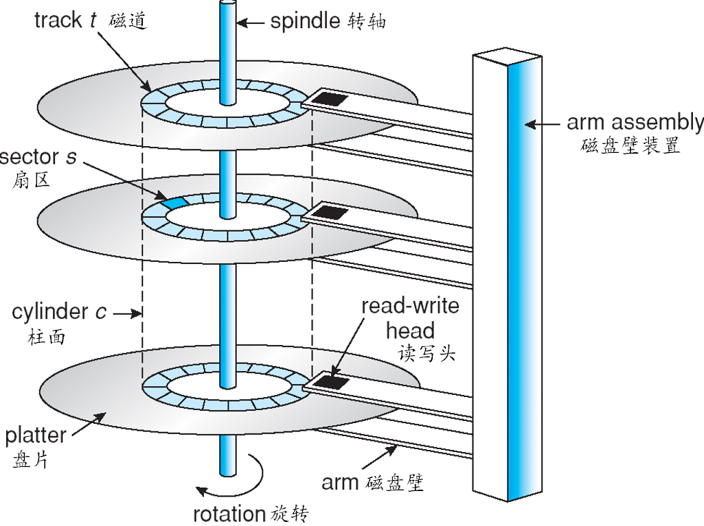
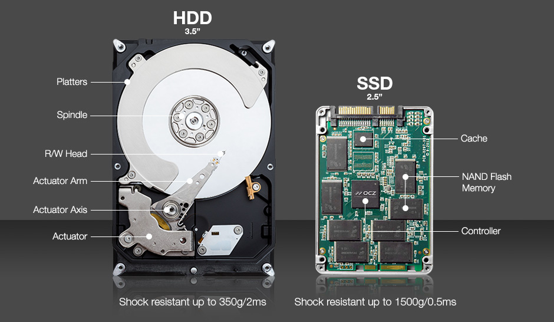

<br>

## 前言

在本文将深入展开在面试过程中操作系统部分的知识，用最简短的篇章深入理解。

## 关于作者

一个工作八年的草根程序员。

## 内容

- 概述
- 进程管理
- 死锁
- 内存管理
- 设备管理
- 链接

### 一、概述

- 操作系统基本特征
- 操作系统基本功能
- 系统调用
- 大内核和微内核
- 中断分类
- 什么是堆和栈？说一下堆栈都存储哪些数据？
- 如何理解分布式锁？

#### 1.1 操作系统基本特征

- 并发与并行
- 共享
- 虚拟
- 异步

##### 并发与并行

**并发**是指宏观上在一段时间内能同时运行多个程序，而**并行**则指同一时刻能运行多个指令。

**并行**需要硬件支持，如多流水线或者多处理器。

操作系统通过引入进程和线程，使得程序能够并发运行。


##### 共享

共享是指系统中的资源可以被多个并发里程共同使用。

有两种共享方式：互斥共享和同时共享。

**互斥共享**的资源称为临界资源，例如打印机等，在同一时间只允许一个进程访问，需要用同步机制来实现对临界资源的访问。

##### 虚拟

虚拟技术把一个物理实体转换为多个逻辑实体。

利用多道程序设计技术，让每个用户都觉得有一个计算机专门为他服务。

主要有两种虚拟技术：**时分复用技术和空分复用技术**。例如多个进程能在同一个处理器上并发执行使用了时分复用技术，让每个进程轮流占有处理器，每次只执行一小个时间片并快速切换。

##### 异步

异步指进程不是一次性执行完毕，而是走走停停，以不可知的速度向前推进。

但只要运行环境相同，OS需要保证程序运行的结果也要相同。

#### 1.2 操作系统基本功能

- 进程管理
- 内存管理
- 文件管理
- 设备管理

##### 进程管理

进程控制、进程同步、进程通信、死锁处理、处理机调试等。

##### 内存管理

内在分配、地址映射、内在保护与共享、虚拟内存等。

##### 文件管理

文件存储空间的管理、目录管理、文件读写管理和保护等。

##### 设备管理

完成用户的I/O请求，方便用户使用各种设备，并提高设备的利用率。

主要包括缓冲管理、设备分配、设备处理、虚拟设备等。

#### 1.3 系统调用

如果一个进程在**用户态**需要使用**内核态**的功能，就进行系统调用从而陷入内核，由操作系统代为完成。


Linux 的系统调用主要有以下这些：

| Task     | Commands                  |
| -------- | ------------------------- |
| 进程控制 | fork();exit();wait();     |
| 进程通信 | pipe();chmget();mmap();   |
| 文件操作 | open();read();write();    |
| 设备操作 | ioctl();read();write();   |
| 信息维护 | getpid();alarm();sleep(); |
| 安全     | chmod();umask();chown();  |


#### 1.4 大内核和微内核

- 大内核
- 微内核

##### 大内核

大内核是将操作系统功能作为一个紧密结合的整体放到内核。

由于各模块共享信息，因此有很高的性能。

##### 微内核

由于操作系统不复杂，因此将一部分操作系统功能移出内核，从而降低内核的复杂性。移出的部分根据分层的原则划分成若干服务，相互独立。

在微内核结构下，操作系统被划分成小的、定义良好的模块，只有微内核这一个运行在内核态，其余模块运行在用户态。

因为需要频繁地在用户态和核心态之间进行切换，所以会有一定的性能损失。


#### 1.5 中断分类

- 外中断
- 异常
- 陷入

##### 外中断

由CPU执行指令以外的事件引起，如I/O完成中断，表示设备输入/输出处理已经完成，处理器能够发送下一个输入/输出请求。此外还有时钟中断、控制台中断等。

##### 异常

由CPU执行指令的内部事件引起，如非法操作码、地址越界、算术溢出等。

##### 陷入

在用户程序中使用系统使用。

| 类型     | 源头                     | 响应方式   | 处理机制                             |
| -------- | ------------------------ | ---------- | ------------------------------------ |
| 中断     | 外设                     | 异步       | 持续，对用户应用程序是透明的         |
| 异常     | 应用程序意想不到的行为   | 同步       | 杀死或重新执行意想不到的应用程序指令 |
| 系统调用 | 应用程序请求操作提供服务 | 异步或同步 | 等待和持续                           |

#### 1.6 什么是堆和栈？说一下堆栈都存储哪些数据？

栈区(stack)——由**编译器**自动分配释放，存放函数的参数值，局部变量的值等。其操作方式类似于数据结构中的栈。

堆区(heap)——一般由**程序员分配释放**，若程序员不释放，程序结束时可能由OS回收。

数据结构中这两个完全就不放一块来讲，数据结构中栈和队列才是好基友，我想新手也很容易区分。

我想需要区分的情况肯定不是在数据结构话题下，而大多是在OS关于不同对象的内存分配这块上。

简单讲的话，在C语言中：

```
int a[N];   // go on a stack
int* a = (int *)malloc(sizeof(int) * N);  // go on a heap
```


#### 1.7 如何理解分布式锁？

分布式锁，是控制分布式系统之间同步访问共享资源的一种方式。在分布式系统中，常常需要协调他们的动作。如果不同的系统或是同一个系统的不同主机之间共享了一个或一组资源，那么访问这些资源的时候，往往需要互斥来防止彼此干扰来保证一致性，在这种情况下，便需要使用到分布式锁。

### 二、进程管理

- 进程与线程
- 进程状态的切换（生命周期）
- 进程调度算法
- 进程同步
- 经典同步问题
- 进程通信
- 线程间通信和进程间通信
- 进程操作
- 孤儿进程和僵尸进程
- 守护进程
- 上下文切换

#### 2.1 进程与线程


- 进程
- 线程
- 区别

##### 2.1.1 进程

**进程是资源分配的基本单位**，用来管理资源（例如：内在，文件，网络等资源）

进程控制块(Process Control Block, PCB)描述进程的基本信息和运行状态，所谓的创建进程和撤销进程，都是指对PCB的操作。**（PCB是描述进程的数据结构）**

下图显示了 4 个程序创建了 4 个进程，这 4 个进程可以并发地执行。


##### 2.1.2 线程

**线程是独立调度的基本单位**，一个进程可以有多个线程，它们共享进程资源。QQ和浏览器是两个进程，浏览器进程里面有很多线程，例如HTTP请求线程、事件响应线程、渲染线程等等，线程的并发执行使得在浏览器中点击一个新链接从而发起HTTP请求时，浏览器还可以响应用户的其它事件。

##### 2.1.3 区别

- **拥有资源**，进程得资源分配的基本单位，但是线程不拥有资源，线程可以访问隶属进程的资源。
- **调度**，线程是独立调试的基本单位，在同一进程中，线程的切换不会引起进程切换，从一个进程内的线程切换到另一个进程中的线程时，会引起进程切换。
- **系统开销**，由于创建或撤销进程时，系统都要为之分配或回收资源，如内存空间、I/O设备等，所付出的开销远大于创建或撤销线程时的开销。类似地，在进行进程切换时，涉及当前执行进程CPU环境的保存及新高度进程CPU环境的设置，而线程切换时只需保存和设置少量寄存器内容，开销很小。
- **通信方面**，进程间通信(IPC)需要进程同步和互斥手段的辅助，以保证数据的一致性。而线程间可以通过直接读/写同一进程中的数据段(如全局变量)来进行通信。

#### 2.2 进程状态的切换（生命周期）


- **就绪状态(ready)**：等待被调度
- **运行状态(running)**
- **阻塞状态(waiting)**：等待资源

应该注意以下内容：

- 只有就绪态和运行态可以相互转换，其它的都是单向转换。就绪状态的进程通过调度算法从而获得CPU时间，转为运行状态；而运行状态的进程，在分配给它的CPU的时间片用完之后就会转为就绪状态，等待下一次调度。
- 阻塞状态就是缺少需要的资源从而由运行状态转换而来，但是该资源不包括CPU时间，缺少CPU时间会从运行态转换为就绪态。
- 进程只能自己阻塞自己，因为只有进程自身才知道何时需要等待某种事件的发生。

#### 2.3 进程调度算法

不同环境的调度算法目标不同，因此需要针对不同环境来讨论调度算法。

- 批处理系统
- 交互式系统
- 实时系统

##### 2.3.1 批处理系统

批处理系统没有太多的用户操作，在该系统中，调度算法目标是保证吞吐量和周转时间（从提交到终止的时间）。

- 先来先服务(FCFS)
- 短作业优先
- 最短剩余时间优先

**先来先服务(FCFS)**，按照请求的顺序进行高度。有利于长作业，但不利于短作业，因为短作业必须一直等待前面的长作业执行完毕才能执行，而长作业又需要执行很长时间，造成了短作业等待时间过长。

**短作业优先(SJF)**，按估计运行时间最短的顺序进行调度。长作业有可能会饿死，处于一直等待短作业执行完毕的状态。因为如果一直有短作业到来，那么长作业永远得不到调度。

**最短剩余时间优先(SRTN)**，按估计剩余时间最短的顺序进行调度。

##### 2.3.2 交互式系统

交互式系统有大量的用户交互操作，在该系统中调度算法的目标是快速地进行响应。

- 时间片轮转
- 优先级调度
- 多级反馈队列

**时间片轮转**

将所有就绪进程按FCFS（先来先服务）的原则排成一个队列，每次调度时，把CPU时间分配给队首进程，该进程可以执行一个时间片。当时间片用完时，由计时器发出时钟中断，调度程序便停止该进程的执行，并将它送往就绪队列的末尾，同时继续把CPU时间分配给队首的进程。

时间片轮转算法的效率和时间片的大小有很大关系。因为进程切换都要保存进程的信息并且载入新进程的信息，如果时间片太小，会导致进程切换得太频繁，在进程切换上就会花过多时间。


**优先级调度**

为每个进程分配一个优先级，按优先级进行调度。

为了防止低优先级永远等不到调度，可以随着时间的失衡增加等待的优先级。

**多级反馈队列**

如果一个进程需要执行100个时间片，如果采用时间片轮转调度算法，那么需要交换100次。

多级队列是为这种需要连续执行多个时间片的进程考虑，它设置了多个队列，每个队列时间片大小都不同，例如1,2,4,8...。进程在第一个队列没执行完，就会被移到下一个队列。这种方式下，之前的进程只需要交换7次。

每个队列优先权也不同，最上面的优先权最高。因此只有上一个队列没有进程在排队，才能调度当前队列上的进程。

可以将这种调度算法看成是**时间片轮转调度算法和优先级调度算法**的结合。


##### 2.3.3 实时系统

实时系统要求一个请求在一个确定时间内得到响应。

分为**硬实时和软实时*，前者必须满足绝对的截止时间，后者可以容忍一定的超时。

参考资料：

- [操作系统典型调度算法_C语言中文网](http://c.biancheng.net/cpp/html/2595.html)

#### 2.4 进程同步

- 临界区
- 同步与互斥
- 信号量
- 管程

##### 2.4.1 临界区

**对临界资源进行访问的那段代码称为临界区。**

为了互斥访问临界资源，每个进程在进入临界区之前，需要先进行检查。

##### 2.4.2 同步与互斥

- 同步：多个进程按一定顺序执行；
- 互斥：多个进程在同一时刻只有一个进程能进入临界区。

##### 2.4.3 信号量

>P和V是来源于两个荷兰词汇，P0---prolaag(荷兰语，尝试减少的意思)，V0---verhoog(荷兰语，增加的意思)

信号量(Semaphone)是一个整形变量，可以对其执行down和up操作，也就是常见的P和V操作。

- **down**:如果信号量大于0，执行-1操作；如果信号量等于0，进程睡眠，等待信号量大于0；(阻塞)
- **up**:对信号量执行+1操作，影印本睡眠的进程让其完成down操作。(唤醒)

down和up操作需要被设计成原语，不可分割，通常的做法是在执行这些操作的时候屏蔽中断。

如果信号量的取值只能为0或者1，那么就成为了**互斥量（Mutex）**，0表示临界区已经加锁，1表示临界区解锁。

```
typedef int semaphore;
semaphore mutex = 1;
void P1() {
    down(&mutex);
    // 临界区
    up(&mutex);
}

void P2() {
    down(&mutex);
    // 临界区
    up(&mutex);
}
```

**使用信号量实现生产者——消费者问题**

问题描述：使用一个缓冲区来保存物品，只有缓冲区没有满，生产者才可以放入物品；只有缓冲区不为空，消费者才可以拿走物品。

因为缓冲区属于临界资源，因此需要使用一个互斥量mutex来控制对缓冲区的互斥访问。

为了同步生产者和消费者的行为，需要记录缓冲区中物品的数量。数量可以使用信号量来进行统计，这里需要使用两个信号：empty记录空缓冲区的数量，full记录缓冲区的数量。其中，empty信号量是在生产者进程中使用，当empty不为0时，生产者才可以放入物品；full信号量是在消费者进程中使用，当full信号量不为0时，消费者才可以取走物品。

注意，不能先对缓冲区进行加锁，再测试信号量。也就是说，不能先执行 down(mutex) 再执行 down(empty)。如果这么做了，那么可能会出现这种情况：生产者对缓冲区加锁后，执行 down(empty) 操作，发现 empty = 0，此时生产者睡眠。消费者不能进入临界区，因为生产者对缓冲区加锁了，也就无法执行 up(empty) 操作，empty 永远都为 0，那么生产者和消费者就会一直等待下去，造成死锁。

```
#define N 100
typedef int semaphore;
semaphore mutex = 1;
semaphore empty = N;
semaphore full = 0;

void producer() {
    while(TRUE){
        int item = produce_item(); // 生产一个产品
        // down(&empty) 和 down(&mutex) 不能交换位置，否则造成死锁
        down(&empty); // 记录空缓冲区的数量，这里减少一个产品空间
        down(&mutex); // 互斥锁
        insert_item(item);
        up(&mutex); // 互斥锁
        up(&full); // 记录满缓冲区的数量，这里增加一个产品
    }
}

void consumer() {
    while(TRUE){
        down(&full); // 记录满缓冲区的数量，减少一个产品
        down(&mutex); // 互斥锁
        int item = remove_item();
        up(&mutex); // 互斥锁
        up(&empty); // 记录空缓冲区的数量，这里增加一个产品空间
        consume_item(item);
    }
}
```

#### 2.5 经典同步问题

#### 2.6 进程通信

#### 2.7 线程间通信和进程间通信

- 线程间通信
- 进程间通信

##### 2.7.1 线程间通信

- **synchronized同步**
  - 这种方式，本质上就是“共享内存”
- **while轮询方式**
  - 在这种方式下，
  - 之所以说它浪费资源，
  - 就类似于现实生活中，
- **wait/notify机制**
  - 当条件未满足时，
- **管道通信**
  - java.io.

##### 2.7.2 进程间通信

- **管道(Pip)**：
- **命名管道(named pipe)**：
- **信号(Signal)**:
- **消息(Message)队列**：
- **共享内存**：
- **内存映射(mapped memory)**：
- **信号量(semaphore)**：
- **套接口(Socket)**：

#### 2.8 进程操作

Linux进程结构可由三部分组成：

- 代码段（程序）
- 数据段（数据）
- 堆栈段（控制块PCB）

#### 2.9 孤儿进程和僵尸进程

#### 2.10 守护进程

#### 2.11 上下文切换

### 三、死锁

### 四、内存管理

- 虚拟内存
- 分页系统地址映射
- 页面置换算法
- 分段
- 段页式
- 分页与分段的比较

#### 4.1 虚拟内存

虚拟内在的目的是为了让物理内存扩充成更大的逻辑内存，从而让程序获得更多的可用内存。

为了更好的管理内存，操作系统将内存抽象成地址空间。每个程序拥有自己的地址空间，这个地址空间被分割成多个块，每一块称为一页。这些页被映射到物理内存，但不需要映射到连续的物理内存，也不需要所有页都必须在物理内存中。当程序引用到一部分不在物理内存中的地址空间时，由硬件执行必要的映射，将缺失的部分装入物理内存并重新执行失败的指令。

从上面的描述中可以看出，虚拟内存允许程序不用将地址空间中的每一页都映射到物理内存，也就是说一个程序不需要全部调入内存可以运行，这使得有限的内在运行大程序成为可能。例如有一台计算机可以产生16位地址，那么一个程序的地址空间范围是0~64K。该计算机只有32KB的物理内存，虚拟内存技术允许该计算机运行一个64K大小的程序。


#### 4.2 分页系统地址映射

- 内存管理单元（MMU）：管理着地址空间和物理内存的转换。
- 页表（Page table）：页（地址空间）和页框（物理内存空间）的映射表。例如下图中，页表的第0个表项为010，表示第0个页映射到第2个页框。页表项的最后一位用来标记页是否在内存中。

下图的页表存放着16个页，这16个页需要用4个比特位来进行索引定位。因此对虚拟地址（0010 000000000100），前4位是用来存储页面号，而后12位存储在页中的偏移量。

（0010 000000000100）根据前 4 位得到页号为 2，读取表项内容为(110 1)，它的前3为页框号，最后1位表示该页在内存中。最后映射得到物理内在地址为（0010 000000000100）


#### 4.3 页面置换算法

在程序运行过程中，如果要访问的页面不在内存中，就发生缺页中断从而将该页调入内存中。此时如果内在已无空闲空间，系统必须从内存中调出一个页面到磁盘对换区中来腾出空间。

页面转换算法和缓存淘汰策略类似，可以将内存看成磁盘的缓存。在缓存系统中，缓存的大小有限，当有新的缓存到达时，需要淘汰一部分已经存在的缓存，这样才有空间存放新的缓存数据。

页面转换算法的主要目标是使页面转换频率最低（也可以说缺页率最低）。

- 最佳
- 最近最久未使用
- 最近未使用
- 先进先出
- 第二次机会算法
- 时钟

##### 4.3.1 最佳(Optimal)

所选择的被换出的页面将是最长时间内不再被访问，通常可以保证获得最低的缺页率。

是一种理论上的算法，因为无法知道一个页面多长时间不再被访问。

举例：一个系统为某进程分配了三个物理地，并有如下页面引用序列：

```
70120304230321201701
```

开始运行时，先将7,0,1三个页面装入内存。当进程要访问页面2时，产生缺页中断，会将页面7换出，因为页面7再次被访问的时间最长。

##### 4.3.2 最近最久未使用(LRU, Least Recently Used)

虽然无法知道将来要使用的页面情况，但是可以知道过去使用页面的情况。LRU将最近最久未使用的页面换出。

为了实现LRU，需要在内存中维护一个所有页面的链表。当一个页面被访问时，将这个页面移到链表表头。这样就能保证链表表尾的页面时最近最久未访问的。

因为每次访问都需要更新链表，因此这种方式实现的LRU代价很高。


##### 4.3.3 最近未使用(NRU, Not Recently Used)


##### 4.3.4 先进先出

##### 4.3.5 第二次机会算法

##### 4.3.6 时钟


#### 4.4 分段

#### 4.5 段页式

#### 4.6 分页与分段的比较


### 五、设备管理

- 磁盘结构
- 磁盘调度算法

#### 5.1 磁盘结构

- 盘面（Platter）：一个磁盘有多个盘面；
- 磁道（Track）：盘面上的圆形带状区域，一个盘面可以有多个磁道；
- 扇区（Track Sector）：磁道上的一个弧段，一个磁道可以有多个扇区，它是最小的物理储存单位，目前主要有512 bytes与4K两种大小；
- 磁头（Head）：与盘面非常接近，能够将盘面上的磁场转换为电信号（读），或者将电信号转换为盘面的磁场（写）；
- 制动手臂（Actuator arm）：用于在磁道之间移动磁头。
- 主轴（Spindle）：使整个盘面转动。




##### 5.2 磁盘调度算法

读写一个磁盘块的时间的影响因素有：

- 旋转时间（主轴旋转磁盘，使得磁头移动到适当的扇区上）
- 寻道时间（制动手臂移动，使得磁头移动到适当的磁道上）
- 实际的数据传输时间

其中，寻道时间最长，因此磁盘调度的主要目标是使磁盘的平均寻道时间最短。

**先来先服务(FCFS, First Come First Served)**

- 按照磁盘请求的顺序进行调度
- 公平对待所有进程
- 在有很多进程的情况下，接近随机调度的性能
- 优点是公平和简单。缺点也很明显，因为未对寻道做任何优化，使平均寻道时间可能较长。


**最短寻道时间优先(SSTF, Shortest Seek Time First)**

优先调度与当前磁头所在磁道距离最近的磁道。虽然平均寻道时间比较低，但是不够公平。如果新到达的磁道请求总是比一个在等待的磁道请求近，那么在等待的磁道请求会一直等待下去，也就是出现饥饿现象。具体来说，两边的磁道请求更容易出现饥饿现象。


**电梯算法(SCAN)**

电梯问题保持一个方向运行，直到该方向没有请求为止，然后改变运行方向。

电梯算法（扫描算法）和电梯的运行过程类似，总是按一个方向来进行磁盘调度，直到该方向上没有未完成的磁盘请求，然后改变方向。

因为考虑了移动方向，因此所有的磁盘请求都会被满足，解决了SSTF的饥饿问题。


### 六、链接

- 编译系统
- 静态链接
- 目标文件
- 动态链接

### 参考资料

- 《深入操作系统第四版》
- [操作系统](https://github.com/frank-lam/fullstack-tutorial/blob/master/notes/%E6%93%8D%E4%BD%9C%E7%B3%BB%E7%BB%9F.md)

## 联系作者

<div align="center">
    <p>
        平凡世界，贵在坚持。
    </p>
    
</div>