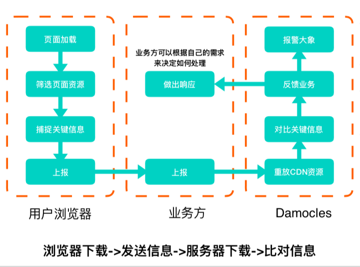

<br>

## 前言

流量劫持主要分为：**DNS劫持**，**数据劫持**。

## 关于作者

一个工作八年的草根程序员。

## 内容

- DNS劫持
- DNS 是如何工作的
- 如何抵御DNS劫持
- 数据劫持
- 如何抵御数据劫持

### 一、DNS劫持

域名劫持是互联网攻击的一种方式，通过攻击DNS服务器，或伪造DNS服务器的方法，**把目标网站域名解析到错误的地址**让用户无法访问到真正的地址。

### 二、DNS 是如何工作的

客户端访问服务端，首先要根据域名获取到对应的IP地址，这一步需要从DNS服务器上获取。请求DNS服务器时，会通过UDP协议在当地网络运营商提供的公共域名服务器中查找IP，如果没有找到，就会继续请求上一级的域名服务器来查找，直到返回IP地址为止。域名劫持，即是在请求DNS解析域名时出现问题，目标目标域名被恶意地解析到其他IP地址，造成用户无法正常使用服务。

为了减少DNS查询时间，HTTP协议栈中会缓存域名解析：

- 浏览器可能会缓存域名解析。
- 用户系统中的域名映射表(Hosts)会缓存域名解析。
- 公共域名服务器通常由ISP（互联网服务提供商）提供。
  - 公共应用服务器会缓存上一级域名服务器的结果。
  - 公共域名服务器TTL到期后，会向顶级域名服务器获取信息。

### 三、如何污染 DNS

常见的污染DNS方式有：

- 篡改Hosts文件。
- 污染中间链路设备(路由器等)。
  - 修改UDP内容，影响DNS查询结果。
- 入侵DNS服务器（攻击成本高）。

### 四、如何抵御DNS劫持

解决域名劫持的一个办法就是绕开安全性较差的UDP协议，通过一个可信的源头来解析域名，解析方式不需要拘泥于UDP协议，也可以通过HTTP的方式。

- DNS over HTTPS
  - 在TLS协议之上传输DNS内容。
- DNS over HTTP
  - 用HTTP协议来传输DNS。
- DNS over HTTPS
  - 用HTTPS协议来传输DNS。
- 使用自己维护的DNS服务器（成本太大）。

### 五、DNS 劫持总结

一般使用http-dns绕过运营商解析域名，达到防止DNS劫持的目的，一些大厂还可以自己维护权威域名服务器，防止支持。

> DNS劫持是属于违法行为，已经被严厉打击，很少见了。

### 六、数据劫持

数据劫持基本针对明文传输的内容发生。用户发起HTTP请求，服务器返回页面内容时，经过中间的运营商网络，页面内容被篡改或加塞内容，强行弹窗或者广告。

### 七、如何抵御数据劫持

行业内解决的办法即是对内容进行HTTPS加密，实现密文传输，彻底避免劫持问题。MD5校验同样能起到防止数据劫持的作用，MD5校验是指内容返回前，应用层对返回的数据进行校验，生成校验值；同时，内容接收方接收到内容后，对内容进行校验，同样生成校验值，将这两个校验值进行比对，倘若一致，则可以判断数据无劫持。

> HTTPS也能被运营商劫持
> 1、伪造证书，通过病毒或者其他方式将伪造证书的根证书安装在用户系统中（较少）。
> 2、代码也有客户的证书与私钥，或者客户商与代理认证的时候不校验合法性，即可通过代理来与我们服务端进行数据交互（较多）。

#### 7.1 Content-Security-Policy (CSP)

(Content-Security-Policy)[https://developer.mozilla.org/zh-CN/docs/Web/HTTP/Headers/Content-Security-Policy__by_cnvoid]的实质就是白名单制度，开发者明确告诉客户端，哪些外部资源可以加载和执行，等同于提供白名单。它的实现和执行全部由浏览器完成，开发者只需提供配置。

- 指定每种资源类型可以加载执行的条件。
- 还可以防御XSS攻击。
- 也可以于强近资源使用HTTPS加载，降低劫持可能性。

两种方式开启CSP：

```
// 通过http头信息Content-Security-Policy: default-src https:

// 通过meta标签<meta http-equiv="Content-Security-Policy" content="default-src https:"/>

```

缺点：

- 由于CSP标识本身存在于HTML标签或者HTTP请求头中，可以被攻击者可以直接移除掉。
- 规则比较复杂。
- 影响动态创建的使用。

#### 7.2 Subresource Integrity (SRI)

[Subresource Integrity](https://developer.mozilla.org/zh-CN/docs/Web/Security/%E5%AD%90%E8%B5%84%E6%BA%90%E5%AE%8C%E6%95%B4%E6%80%A7)允许浏览器检查其获得的资源（例如从CDN获得的）是否被篡改的一项安全特性。

```
<script crossorigin="anonymous" integrity=“sha256-+Ec97...E=“ src=“https://a.com"></script>

```

缺点：

- 由于SRI标识本身存在于HTML标签中，可以被攻击者可以直接移除掉。
- 影响动态创建脚本的使用。
- 校验失败时影响可用性。
- 兼容性有限，IOS Safari不支持。

#### 7.3 HTTP Strict-Transport-Security

在HTTPS响应报文的头部中，增加一个名为[Strict-Transport-Security](https://developer.mozilla.org/zh-CN/docs/Security/HTTP_Strict_Transport_Security)(HSTS)的头，内容是这个头的有效期。当浏览器在HTTPS响应中看到它时，**下一次浏览器会直接使用HTTPS来进行请求**。

```
Strict-Transport-Security: max-age=<expire-time>

```

缺点：

- 只有HTTPS的响应才会去识别HSTS。
- 用户的第一次访问不受控。

#### 7.4 X-FRAME-OPTIONS

X-FRAME-OPTIONS 是一个HTTP响应头，在现代浏览器有一个很好的支持。网站可以使用此功能，来确保自己网站的内容没有被嵌到别人的网站中去，也从而避免了点击劫持的攻击。

该响应头有三个值可选，分别是：

- DENY，表示页面不允许通过Iframe的方式展示。
- SAMEORIGIN，表示页面可以在相同域名下通过Iframe的方式展示。
- ALLOW-FROM，表示页面可以在指定来源的Iframe中展示。


### 八、数据劫持总结

- 使用CSP限制外部JS文件加载。
- 使用HTTPS加密传输数据，确保内容保密。
- 使用SRI校验文件一致性。
- 使用HSTS强制用户使用HTTPS访问。
- 使用X-Frame-Options确保页面不被嵌入iframe。

>以上方法都只能起到监控数据劫持作用，并不能对劫持后的页面进行修复。

### 九、现有方案

此方案参考了着墨点评2018前端分享上的防治方案。

- 方案A：在某些省份、地区创建监测站，定期抓取固定资源（资源太固定，监测站数量也远远不够）。
- 方案B：业务A在自己的HTML中监听资源的Error事件（方法确认问题在于劫持，也可能只是普通的JS出错）。
- 方案C：使用第三方企业服务进监控（服务越多成本越大）。
- 方案D：CSP、SRI（兼容性和灵活性差，方法进行定义逻辑）。

以述方案可以看出，无论哪种方案，都有它的不足，于是搭建了下图方案：



优势如下：

- 监控的级别是业务级甚至页面级，而不是某个固定的资源。
- 在业务方的Node.js中内置逻辑，给予了业务方自己进行降级和响应的能力。
- 监控层如果出现故障，不影响业务方的代码执行。

### 十、其他解决方案

- APP端采用Hyhrid方案加载Webview
- 业务代码规范

#### 9.1 APP端采用Hyhrid方案加载Webview

App里的Webview不直接请求一个链接，而先下载一个Download.zip文件，解压后App内部直接渲染，越过了HTTP层面，从而避免数据被劫持。

#### 9.2 业务代码规范

1. 在页面DOM中定义一个根元素Root，所有的业务代码都在这里，页面渲染完毕后，直接清理掉非Root元素目录下的其他元素。
2. Script标签打上自定义属性，页面渲染时，把没有打自定义属性的删掉。
3. MutationObserver监听DOM插入，如果是非法JS或HTML，则阻止。
4. 将搜集到的错误进行上报。

- 上报是否被套在Iframe。
- 上报是否有其他代码被插入。
- 上报被CSP屏蔽的外部链接。
- 附带上传客户UID等。


### 参考资料

- [流量劫持](https://yhlben.github.io/blog/osi-hijack.html)
  
## 联系作者

<div align="center">
    <p>
        平凡世界，贵在坚持。
    </p>
    
</div>